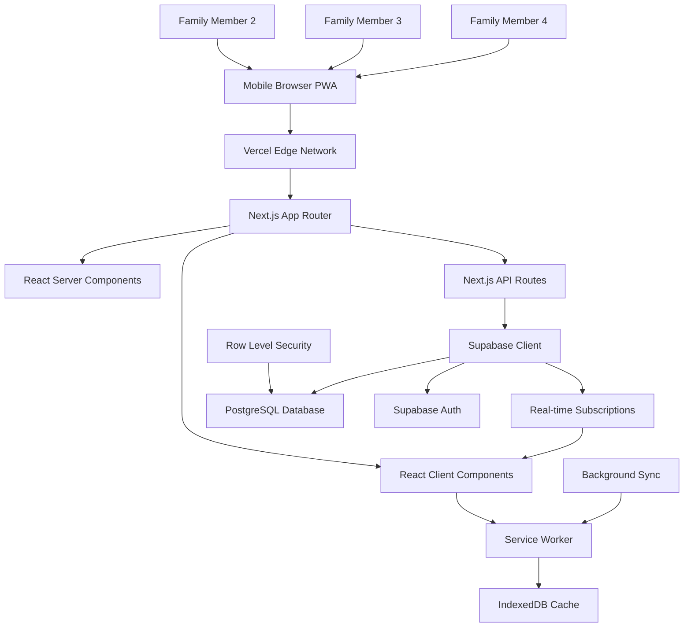
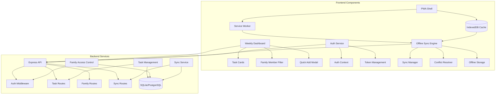
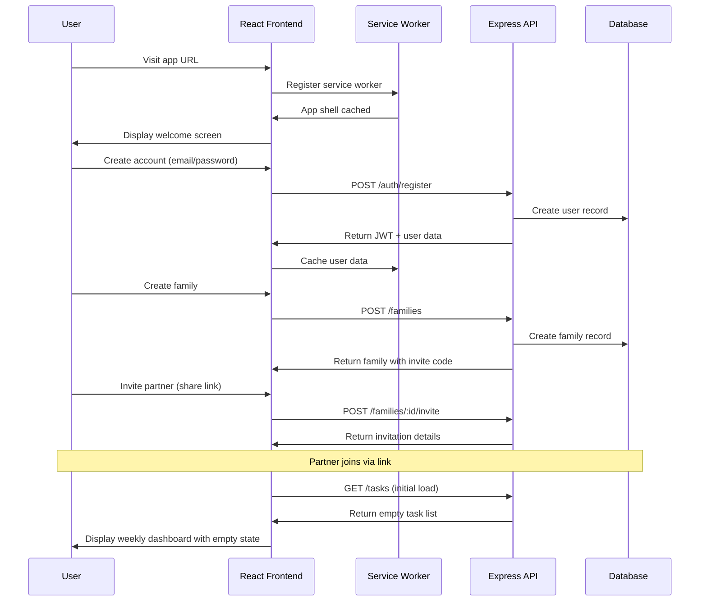
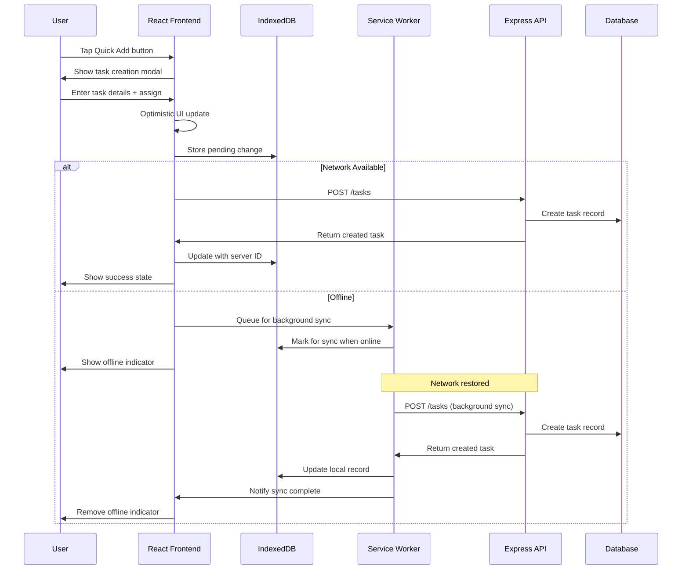
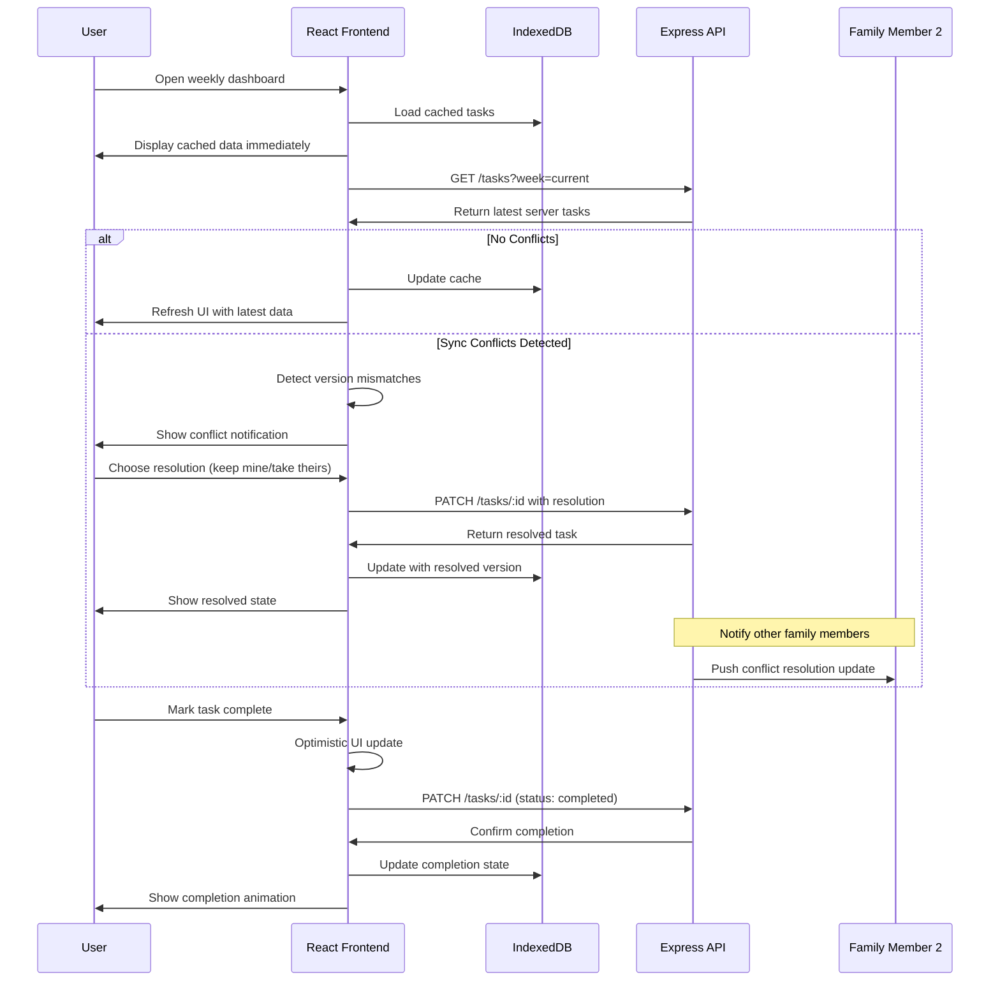
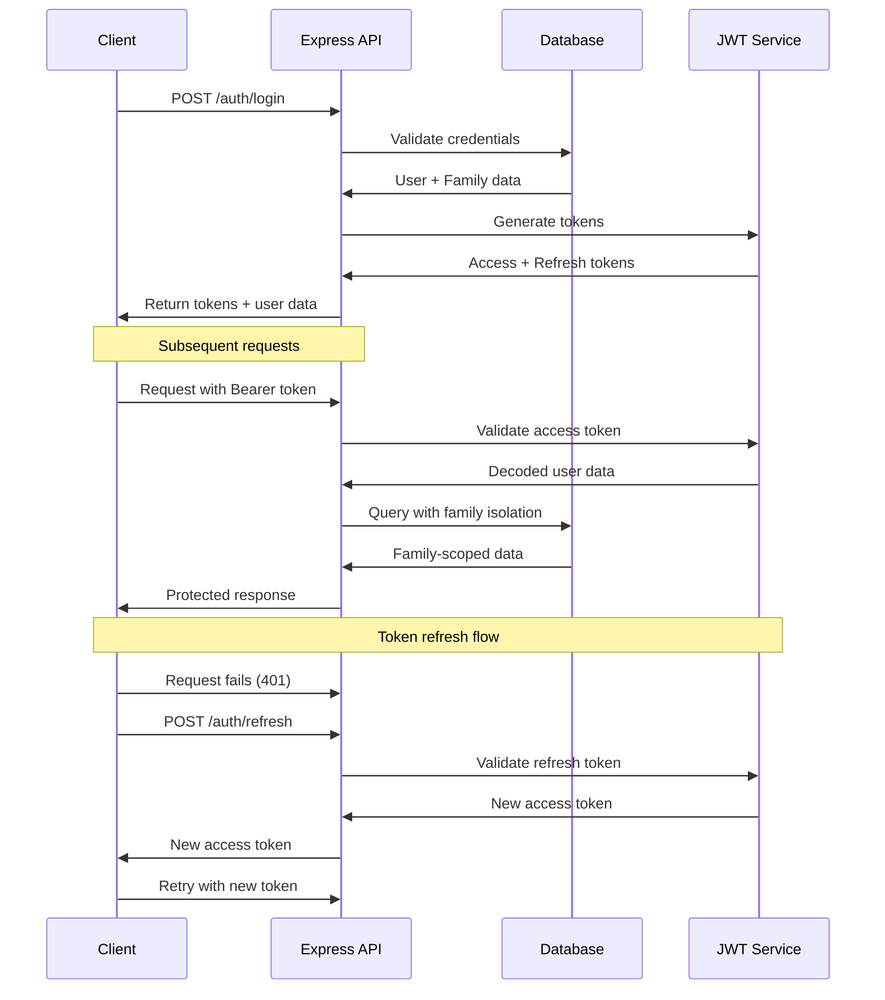
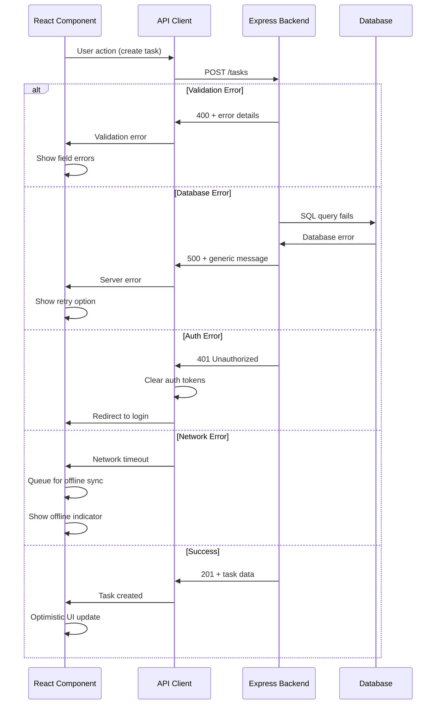

# FamilySync Fullstack Architecture Document

## Introduction

This document outlines the complete fullstack architecture for FamilySync, including backend systems, frontend implementation, and their integration. It serves as the single source of truth for AI-driven development, ensuring consistency across the entire technology stack.

This unified approach combines what would traditionally be separate backend and frontend architecture documents, streamlining the development process for modern fullstack applications where these concerns are increasingly intertwined.

### Starter Template or Existing Project

**Status:** N/A - Greenfield Project

Based on the PRD and Front-End Specification, this is a greenfield project building a family coordination PWA from scratch. No existing starter templates are mentioned in the requirements.

### Change Log

| Date | Version | Description | Author |
|------|---------|-------------|---------|
| 2025-09-01 | 1.0 | Initial fullstack architecture creation | Winston (Architect) |

## High Level Architecture

### Technical Summary

FamilySync is built as a mobile-first Progressive Web App (PWA) using Next.js 14+ with the App Router for optimal full-stack integration. The architecture leverages React Server Components for fast initial loads, Next.js API Routes for serverless backend functions, and Supabase for managed PostgreSQL database with real-time capabilities. The frontend implements React 18 with TypeScript, supporting the weekly dashboard, quick-add workflows, and family coordination features defined in the UI/UX specification. Supabase provides built-in authentication, Row Level Security for family data isolation, and real-time subscriptions for live coordination updates. The architecture emphasizes service worker implementation for offline functionality, IndexedDB for local persistence, and optimistic UI updates to maintain the "Glance-and-Go" performance targets while supporting seamless family member collaboration across devices.

### Platform and Infrastructure Choice

**Platform:** Vercel + Supabase Full-Stack Architecture  
**Key Services:** Vercel (Next.js Full-Stack), Supabase (PostgreSQL + Auth + Real-time), IndexedDB (Offline Storage), Service Worker (PWA)  
**Deployment Host and Regions:** Global CDN via Vercel Edge Network, Supabase global multi-region PostgreSQL  

**Rationale:** Vercel provides optimal Next.js deployment with zero-config PWA support and global edge caching. Supabase eliminates backend complexity with managed PostgreSQL, built-in authentication, Row Level Security, and real-time subscriptions - perfect for solo developer productivity while supporting 10,000+ families from day one without migration complexity.

### Repository Structure

**Structure:** Next.js monolithic full-stack application  
**Monorepo Tool:** Not required - single Next.js project with organized folder structure  
**Package Organization:** Next.js app with organized src/ structure for components, API routes, and utilities - simplified for solo developer efficiency

### High Level Architecture Diagram



### Architectural Patterns

- **Next.js App Router:** File-based routing with React Server Components for optimal performance - _Rationale:_ Enables fast initial loads, simplified architecture, and excellent developer experience for solo development
- **Progressive Web App (PWA):** Offline-first architecture with service workers and app shell caching - _Rationale:_ Enables 7-day offline capability and native app-like experience on mobile devices
- **Component-Based UI:** Reusable React components with TypeScript interfaces - _Rationale:_ Supports the detailed component library from front-end spec and enables consistent UX patterns
- **Supabase Real-time:** WebSocket-based real-time subscriptions - _Rationale:_ Enables live family coordination updates without polling, reducing server load and improving UX
- **Row Level Security (RLS):** Database-level family data isolation - _Rationale:_ Eliminates backend filtering complexity and prevents cross-family data access at the database layer
- **Optimistic UI Updates:** Immediate UI feedback before server confirmation - _Rationale:_ Critical for "Glance-and-Go" performance targets and mobile responsiveness
- **Offline-First Sync:** Local-first architecture with eventual consistency - _Rationale:_ Core differentiator supporting reliable family coordination during network outages

## Tech Stack

### Technology Stack Table

| Category | Technology | Version | Purpose | Rationale |
|----------|------------|---------|---------|-----------|
| Frontend Language | TypeScript | 5.2+ | Type safety across components and API calls | Prevents runtime errors and enables better IDE support for component architecture |
| Frontend Framework | Next.js | 14.2+ | Full-stack React framework with App Router | Server Components for performance, API Routes for serverless backend, excellent PWA support |
| UI Component Library | Custom + Tailwind CSS | Latest | Mobile-first responsive design system | Front-end spec requires custom lightweight components, Tailwind enables rapid mobile-optimized styling |
| State Management | React Query + Zustand | 5.0+ / 4.4+ | Server state (React Query) + Client state (Zustand) | React Query handles Supabase integration and offline sync, Zustand for simple local state |
| Backend Framework | Next.js API Routes | 14.2+ | Serverless functions integrated with frontend | Eliminates separate backend complexity, optimal for solo developer, automatic Vercel deployment |
| Database Service | Supabase PostgreSQL | Latest | Managed PostgreSQL with real-time capabilities | Built-in auth, Row Level Security, real-time subscriptions, eliminates migration complexity |
| API Style | REST + Real-time | HTTP + WebSocket | RESTful endpoints with live subscriptions | Simple REST for mutations, WebSocket subscriptions for live updates, works with service workers |
| Authentication | Supabase Auth | Latest | Managed authentication with JWT tokens | Built-in user management, MFA support, automatic token refresh, reduces auth complexity by 80% |
| Cache | IndexedDB | Native | Offline-first local storage | Browser-native, supports complex queries needed for weekly dashboard |
| File Storage | Supabase Storage | Latest | Managed cloud storage for future file uploads | Integrated with database, automatic CDN, simple API, scales with usage |
| Frontend Testing | Jest + React Testing Library | Latest | Unit and integration testing for components | Matches React patterns, supports component testing from front-end spec |
| Backend Testing | Jest + Supabase Test Client | Latest | API endpoint and database testing | Tests Next.js API routes with Supabase, supports RLS policy testing |
| E2E Testing | Playwright | Latest | Critical user flow testing | Excellent PWA support, cross-browser mobile testing capabilities |
| Build Tool | Next.js | 14.2+ | Integrated build system with optimizations | Built-in TypeScript, CSS, image optimization, automatic code splitting |
| Bundler | Turbopack | Next.js 14+ | Next-generation bundler for development | Faster than Webpack, built into Next.js, optimal for large applications |
| IaC Tool | Vercel Configuration | Built-in | Simple deployment via vercel.json | Zero-config deployment, environment variables, preview deployments |
| CI/CD | Vercel + GitHub | Built-in | Automatic deployment on git push | Integrated with Vercel, automatic preview deployments, built-in testing |
| Monitoring | Vercel Analytics + Supabase Dashboard | Built-in | Performance and error tracking | Web vitals, database performance, real-time logs, no additional setup |
| Logging | Next.js Built-in + Supabase Logs | Latest | Structured logging with database audit trail | Console logging for development, Supabase logs for production debugging |
| CSS Framework | Tailwind CSS | 3.4+ | Utility-first mobile-responsive styling | Perfect match for front-end spec design system and mobile-first approach |

## Data Models

### Family

**Purpose:** Core entity representing a household coordination unit with shared access to tasks and events

**Key Attributes:**
- id: string (UUID) - Unique family identifier for data isolation
- name: string - Family display name for UI personalization
- createdAt: Date - Audit trail for family creation
- inviteCode: string - Secure invitation mechanism for family member joining
- settings: FamilySettings - Customization preferences for coordination workflows

#### TypeScript Interface

```typescript
interface Family {
  id: string;
  name: string;
  createdAt: Date;
  updatedAt: Date;
  inviteCode: string;
  settings: {
    weekStartDay: 'sunday' | 'monday';
    timezone: string;
    notifications: {
      taskDue: boolean;
      taskAssigned: boolean;
      taskCompleted: boolean;
    };
  };
}
```

#### Relationships
- Has many FamilyMembers (1-4 members per PRD requirements)
- Has many Tasks through FamilyMembers
- Has many Events through FamilyMembers

### FamilyMember

**Purpose:** Individual user account within a family context, enabling task assignment and ownership tracking

**Key Attributes:**
- id: string (UUID) - Unique user identifier
- familyId: string - Foreign key for family data isolation
- email: string - Authentication credential and invitation target
- name: string - Display name for task ownership visual identification
- role: string - Admin vs Member permissions for family management
- avatarColor: string - Consistent color coding per front-end spec requirements

#### TypeScript Interface

```typescript
interface FamilyMember {
  id: string;
  familyId: string;
  email: string;
  passwordHash: string;
  name: string;
  role: 'admin' | 'member';
  avatarColor: string;
  isActive: boolean;
  createdAt: Date;
  updatedAt: Date;
  lastSeenAt: Date;
}
```

#### Relationships
- Belongs to Family
- Has many Tasks (as assignee)
- Has many Events (as assignee)
- Has many audit logs for coordination tracking

### Task

**Purpose:** Core coordination entity representing family responsibilities with assignment, due dates, and completion tracking

**Key Attributes:**
- id: string (UUID) - Unique task identifier
- familyId: string - Data isolation enforcement
- title: string - Primary task description for weekly dashboard display
- assigneeId: string - Ownership for visual identification and workload distribution
- dueDate: Date - Optional deadline for priority ordering
- status: TaskStatus - Completion state for visual indicators
- category: string - Grouping for weekly dashboard organization

#### TypeScript Interface

```typescript
interface Task {
  id: string;
  familyId: string;
  title: string;
  description?: string;
  assigneeId: string;
  createdById: string;
  dueDate?: Date;
  completedAt?: Date;
  status: 'pending' | 'in_progress' | 'completed';
  category: 'task' | 'event';
  priority: 'low' | 'medium' | 'high';
  createdAt: Date;
  updatedAt: Date;
  syncVersion: number; // For offline conflict resolution
}
```

#### Relationships
- Belongs to Family
- Assigned to FamilyMember
- Created by FamilyMember
- Has many TaskNotes for detailed coordination

### Event

**Purpose:** Time-specific family coordination item with scheduling and calendar integration requirements

**Key Attributes:**
- id: string (UUID) - Unique event identifier
- familyId: string - Family data isolation
- title: string - Event name for calendar display
- assigneeId: string - Event responsibility assignment
- startDateTime: Date - Scheduled time for weekly dashboard positioning
- endDateTime: Date - Duration calculation for family workload view
- location: string - Optional location for coordination context

#### TypeScript Interface

```typescript
interface Event {
  id: string;
  familyId: string;
  title: string;
  description?: string;
  assigneeId: string;
  createdById: string;
  startDateTime: Date;
  endDateTime: Date;
  location?: string;
  status: 'scheduled' | 'in_progress' | 'completed' | 'cancelled';
  createdAt: Date;
  updatedAt: Date;
  syncVersion: number;
}
```

#### Relationships
- Belongs to Family
- Assigned to FamilyMember
- Created by FamilyMember

## API Specification

### Next.js API Routes Specification

```yaml
openapi: 3.0.0
info:
  title: FamilySync API
  version: 1.0.0
  description: Family coordination and task management API via Next.js API Routes
servers:
  - url: https://familysync.vercel.app/api
    description: Production server (Vercel)
  - url: http://localhost:3000/api
    description: Development server

paths:
  /auth/register:
    post:
      summary: Register new user account (via Supabase Auth)
      description: Uses Supabase Auth for user registration with automatic JWT token management
      requestBody:
        required: true
        content:
          application/json:
            schema:
              type: object
              properties:
                email:
                  type: string
                  format: email
                password:
                  type: string
                  minLength: 12
                name:
                  type: string
      responses:
        '201':
          description: User created successfully
          content:
            application/json:
              schema:
                type: object
                properties:
                  user:
                    $ref: '#/components/schemas/SupabaseUser'
                  session:
                    $ref: '#/components/schemas/SupabaseSession'

  /auth/session:
    get:
      summary: Get current user session
      description: Returns current authenticated user via Supabase Auth
      security:
        - supabaseAuth: []
      responses:
        '200':
          description: Session retrieved successfully
          content:
            application/json:
              schema:
                type: object
                properties:
                  user:
                    $ref: '#/components/schemas/SupabaseUser'
                  session:
                    $ref: '#/components/schemas/SupabaseSession'

  /families:
    post:
      summary: Create new family
      description: Creates family with RLS policies automatically applied
      security:
        - supabaseAuth: []
      requestBody:
        required: true
        content:
          application/json:
            schema:
              type: object
              properties:
                name:
                  type: string
      responses:
        '201':
          description: Family created with automatic RLS setup
          content:
            application/json:
              schema:
                $ref: '#/components/schemas/Family'

  /families/[familyId]/invite:
    post:
      summary: Generate family invitation
      description: Next.js dynamic route with family ID parameter
      security:
        - supabaseAuth: []
      responses:
        '200':
          description: Invitation code generated
          content:
            application/json:
              schema:
                type: object
                properties:
                  inviteCode:
                    type: string
                  expiresAt:
                    type: string
                    format: date-time

  /families/join/[inviteCode]:
    post:
      summary: Join family using invitation code
      description: Next.js dynamic route with invite code parameter
      security:
        - supabaseAuth: []
      responses:
        '200':
          description: Successfully joined family with RLS access
          content:
            application/json:
              schema:
                $ref: '#/components/schemas/Family'

  /tasks:
    get:
      summary: Get family tasks with RLS filtering
      description: Automatically filtered by family via RLS policies
      security:
        - supabaseAuth: []
      parameters:
        - name: week
          in: query
          schema:
            type: string
            format: date
          description: Week start date (YYYY-MM-DD)
        - name: assigneeId
          in: query
          schema:
            type: string
          description: Filter by assigned family member
      responses:
        '200':
          description: Tasks retrieved with automatic family filtering
          content:
            application/json:
              schema:
                type: array
                items:
                  $ref: '#/components/schemas/Task'

    post:
      summary: Create new task with real-time broadcast
      description: Creates task and broadcasts to family members via Supabase real-time
      security:
        - supabaseAuth: []
      requestBody:
        required: true
        content:
          application/json:
            schema:
              type: object
              properties:
                title:
                  type: string
                description:
                  type: string
                assigneeId:
                  type: string
                dueDate:
                  type: string
                  format: date-time
                category:
                  type: string
                  enum: [task, event]
                priority:
                  type: string
                  enum: [low, medium, high]
      responses:
        '201':
          description: Task created with real-time notification
          content:
            application/json:
              schema:
                $ref: '#/components/schemas/Task'

  /tasks/[taskId]:
    patch:
      summary: Update task with conflict resolution
      description: Next.js dynamic route with optimistic locking
      security:
        - supabaseAuth: []
      requestBody:
        required: true
        content:
          application/json:
            schema:
              type: object
              properties:
                title:
                  type: string
                description:
                  type: string
                assigneeId:
                  type: string
                dueDate:
                  type: string
                  format: date-time
                status:
                  type: string
                  enum: [pending, in_progress, completed]
                version:
                  type: number
                  description: Optimistic locking version
      responses:
        '200':
          description: Task updated with real-time broadcast
          content:
            application/json:
              schema:
                $ref: '#/components/schemas/Task'
        '409':
          description: Conflict detected via version mismatch
          content:
            application/json:
              schema:
                type: object
                properties:
                  error:
                    type: string
                  latestVersion:
                    $ref: '#/components/schemas/Task'

  /sync:
    post:
      summary: Bulk sync offline changes
      security:
        - bearerAuth: []
      requestBody:
        required: true
        content:
          application/json:
            schema:
              type: object
              properties:
                lastSyncAt:
                  type: string
                  format: date-time
                changes:
                  type: array
                  items:
                    type: object
                    properties:
                      operation:
                        type: string
                        enum: [create, update, delete]
                      entityType:
                        type: string
                        enum: [task, event]
                      entityId:
                        type: string
                      data:
                        type: object
                      clientTimestamp:
                        type: string
                        format: date-time
      responses:
        '200':
          description: Sync completed
          content:
            application/json:
              schema:
                type: object
                properties:
                  conflicts:
                    type: array
                    items:
                      type: object
                  serverChanges:
                    type: array
                    items:
                      type: object
                  syncTimestamp:
                    type: string
                    format: date-time

components:
  securitySchemes:
    supabaseAuth:
      type: http
      scheme: bearer
      bearerFormat: JWT
      description: Supabase Auth JWT token in Authorization header
  
  schemas:
    SupabaseUser:
      type: object
      properties:
        id:
          type: string
          description: Supabase user UUID
        email:
          type: string
        user_metadata:
          type: object
          properties:
            name:
              type: string
            avatar_color:
              type: string
        created_at:
          type: string
          format: date-time
    
    SupabaseSession:
      type: object
      properties:
        access_token:
          type: string
        refresh_token:
          type: string
        expires_in:
          type: number
        expires_at:
          type: number
        token_type:
          type: string

    Family:
      type: object
      properties:
        id:
          type: string
          description: UUID generated by Supabase
        name:
          type: string
        created_at:
          type: string
          format: date-time
        invite_code:
          type: string
        settings:
          type: object
          description: JSONB column in PostgreSQL

    Task:
      type: object
      properties:
        id:
          type: string
          description: UUID generated by Supabase
        family_id:
          type: string
          description: Foreign key with RLS filtering
        title:
          type: string
        description:
          type: string
        assignee_id:
          type: string
        created_by_id:
          type: string
        due_date:
          type: string
          format: date-time
        completed_at:
          type: string
          format: date-time
        status:
          type: string
          enum: [pending, in_progress, completed]
        category:
          type: string
          enum: [task, event]
        priority:
          type: string
          enum: [low, medium, high]
        version:
          type: number
          description: Optimistic locking version
        created_at:
          type: string
          format: date-time
        updated_at:
          type: string
          format: date-time
```

## Components

### Frontend PWA Shell

**Responsibility:** Service worker management, offline detection, app shell caching, and PWA installation prompts

**Key Interfaces:**
- Service worker registration and lifecycle management
- IndexedDB cache coordination with backend sync
- Network status detection and offline UI state management
- PWA install prompt handling

**Dependencies:** Browser APIs (Service Worker, IndexedDB, Notification), React context providers

**Technology Stack:** Service Worker API, Workbox for caching strategies, React context for offline state

### Weekly Dashboard Component

**Responsibility:** Primary UI component implementing the weekly calendar view with family task visualization and quick interaction patterns

**Key Interfaces:**
- WeekNavigationProps for week switching
- TaskCardProps for individual task rendering
- FamilyMemberFilter for workload distribution view
- QuickAddModal trigger integration

**Dependencies:** React Query for server state, Zustand for local UI state, Task and Event data models

**Technology Stack:** React 18 functional components, Tailwind CSS grid system, React Query mutations for optimistic updates

### Task Management Service

**Responsibility:** Backend business logic for task CRUD operations, family data isolation enforcement, and sync conflict resolution

**Key Interfaces:**
- REST API endpoints (/tasks, /tasks/:id)
- Database repository interface for SQLite/PostgreSQL abstraction
- Family permission validation middleware
- Sync conflict detection and resolution logic

**Dependencies:** Express.js routing, database connection, JWT authentication middleware, family access control

**Technology Stack:** Node.js/Express controllers, repository pattern for data access, bcrypt for security

### Offline Sync Engine

**Responsibility:** Client-side coordination of online/offline state, optimistic UI updates, change queue management, and conflict resolution

**Key Interfaces:**
- SyncManager for orchestrating sync operations
- ConflictResolver for handling server/client data mismatches
- OfflineStorage interface for IndexedDB operations
- NetworkStatusProvider for connectivity monitoring

**Dependencies:** IndexedDB storage, React Query cache invalidation, Service Worker background sync

**Technology Stack:** IndexedDB API, React Query for server state management, custom sync logic with exponential backoff

### Authentication & Authorization Service

**Responsibility:** JWT token management, family-based access control, user session handling, and secure family invitation system

**Key Interfaces:**
- AuthProvider React context for token management
- Family access control middleware for API routes
- Invitation code generation and validation
- Password security and session management

**Dependencies:** JWT library, bcrypt for password hashing, Express.js middleware, family data model

**Technology Stack:** jsonwebtoken, bcrypt, Express.js middleware pattern, React context API

### Component Diagrams



## External APIs

No external APIs are required for the MVP implementation. FamilySync is designed as a self-contained family coordination system to maintain simplicity and avoid external dependencies that could impact offline functionality.

**Future Considerations:**
- Email service (SendGrid/Mailgun) for invitation emails when scaling beyond 1,000 families
- Push notification service for mobile engagement
- Calendar integration (Google Calendar/iCloud) for enhanced family coordination

## Core Workflows

### Family Onboarding and Setup Flow



### Quick Task Creation with Offline Support



### Weekly Coordination Check with Conflict Resolution



## Database Schema

```sql
-- Family coordination database schema
-- Initial SQLite implementation with PostgreSQL migration path

-- Families table for household coordination units
CREATE TABLE families (
    id TEXT PRIMARY KEY,
    name TEXT NOT NULL,
    invite_code TEXT UNIQUE NOT NULL,
    settings JSON NOT NULL DEFAULT '{}',
    created_at DATETIME NOT NULL DEFAULT CURRENT_TIMESTAMP,
    updated_at DATETIME NOT NULL DEFAULT CURRENT_TIMESTAMP
);

-- Family members with role-based permissions
CREATE TABLE family_members (
    id TEXT PRIMARY KEY,
    family_id TEXT NOT NULL,
    email TEXT UNIQUE NOT NULL,
    password_hash TEXT NOT NULL,
    name TEXT NOT NULL,
    role TEXT NOT NULL DEFAULT 'member' CHECK (role IN ('admin', 'member')),
    avatar_color TEXT NOT NULL,
    is_active BOOLEAN NOT NULL DEFAULT 1,
    created_at DATETIME NOT NULL DEFAULT CURRENT_TIMESTAMP,
    updated_at DATETIME NOT NULL DEFAULT CURRENT_TIMESTAMP,
    last_seen_at DATETIME NOT NULL DEFAULT CURRENT_TIMESTAMP,
    
    FOREIGN KEY (family_id) REFERENCES families (id) ON DELETE CASCADE
);

-- Tasks for family coordination
CREATE TABLE tasks (
    id TEXT PRIMARY KEY,
    family_id TEXT NOT NULL,
    title TEXT NOT NULL,
    description TEXT,
    assignee_id TEXT NOT NULL,
    created_by_id TEXT NOT NULL,
    due_date DATETIME,
    completed_at DATETIME,
    status TEXT NOT NULL DEFAULT 'pending' CHECK (status IN ('pending', 'in_progress', 'completed')),
    category TEXT NOT NULL DEFAULT 'task' CHECK (category IN ('task', 'event')),
    priority TEXT NOT NULL DEFAULT 'medium' CHECK (priority IN ('low', 'medium', 'high')),
    sync_version INTEGER NOT NULL DEFAULT 1,
    created_at DATETIME NOT NULL DEFAULT CURRENT_TIMESTAMP,
    updated_at DATETIME NOT NULL DEFAULT CURRENT_TIMESTAMP,
    
    FOREIGN KEY (family_id) REFERENCES families (id) ON DELETE CASCADE,
    FOREIGN KEY (assignee_id) REFERENCES family_members (id) ON DELETE CASCADE,
    FOREIGN KEY (created_by_id) REFERENCES family_members (id) ON DELETE CASCADE
);

-- Events for time-specific family coordination
CREATE TABLE events (
    id TEXT PRIMARY KEY,
    family_id TEXT NOT NULL,
    title TEXT NOT NULL,
    description TEXT,
    assignee_id TEXT NOT NULL,
    created_by_id TEXT NOT NULL,
    start_datetime DATETIME NOT NULL,
    end_datetime DATETIME NOT NULL,
    location TEXT,
    status TEXT NOT NULL DEFAULT 'scheduled' CHECK (status IN ('scheduled', 'in_progress', 'completed', 'cancelled')),
    sync_version INTEGER NOT NULL DEFAULT 1,
    created_at DATETIME NOT NULL DEFAULT CURRENT_TIMESTAMP,
    updated_at DATETIME NOT NULL DEFAULT CURRENT_TIMESTAMP,
    
    FOREIGN KEY (family_id) REFERENCES families (id) ON DELETE CASCADE,
    FOREIGN KEY (assignee_id) REFERENCES family_members (id) ON DELETE CASCADE,
    FOREIGN KEY (created_by_id) REFERENCES family_members (id) ON DELETE CASCADE
);

-- Sync audit trail for offline conflict resolution
CREATE TABLE sync_logs (
    id TEXT PRIMARY KEY,
    family_id TEXT NOT NULL,
    entity_type TEXT NOT NULL CHECK (entity_type IN ('task', 'event')),
    entity_id TEXT NOT NULL,
    operation TEXT NOT NULL CHECK (operation IN ('create', 'update', 'delete')),
    user_id TEXT NOT NULL,
    old_data JSON,
    new_data JSON NOT NULL,
    sync_version INTEGER NOT NULL,
    client_timestamp DATETIME NOT NULL,
    server_timestamp DATETIME NOT NULL DEFAULT CURRENT_TIMESTAMP,
    
    FOREIGN KEY (family_id) REFERENCES families (id) ON DELETE CASCADE,
    FOREIGN KEY (user_id) REFERENCES family_members (id) ON DELETE CASCADE
);

-- Performance indexes for weekly dashboard queries
CREATE INDEX idx_tasks_family_due_date ON tasks(family_id, due_date);
CREATE INDEX idx_tasks_assignee ON tasks(assignee_id);
CREATE INDEX idx_tasks_status ON tasks(status);
CREATE INDEX idx_tasks_sync_version ON tasks(family_id, sync_version);

CREATE INDEX idx_events_family_start_date ON events(family_id, start_datetime);
CREATE INDEX idx_events_assignee ON events(assignee_id);
CREATE INDEX idx_events_sync_version ON events(family_id, sync_version);

CREATE INDEX idx_family_members_family ON family_members(family_id);
CREATE INDEX idx_family_members_email ON family_members(email);

CREATE INDEX idx_sync_logs_family_timestamp ON sync_logs(family_id, server_timestamp);

-- Optimistic locking trigger to increment version on updates
CREATE OR REPLACE FUNCTION increment_version()
RETURNS TRIGGER AS $$
BEGIN
    NEW.version = OLD.version + 1;
    RETURN NEW;
END;
$$ language 'plpgsql';

CREATE TRIGGER increment_task_version BEFORE UPDATE ON tasks
    FOR EACH ROW EXECUTE FUNCTION increment_version();

CREATE TRIGGER increment_event_version BEFORE UPDATE ON events
    FOR EACH ROW EXECUTE FUNCTION increment_version();

-- Database functions for common operations
CREATE OR REPLACE FUNCTION get_user_family_id(user_id UUID)
RETURNS UUID AS $$
    SELECT family_id FROM family_members WHERE id = user_id LIMIT 1;
$$ LANGUAGE SQL STABLE;

CREATE OR REPLACE FUNCTION is_family_admin(user_id UUID)
RETURNS BOOLEAN AS $$
    SELECT EXISTS(SELECT 1 FROM family_members WHERE id = user_id AND role = 'admin');
$$ LANGUAGE SQL STABLE;
```

## Frontend Architecture

### Component Architecture

#### Component Organization

```
src/
├── components/           # Reusable UI components
│   ├── ui/              # Basic UI components (Button, Input, etc.)
│   ├── task/            # Task-specific components
│   │   ├── TaskCard.tsx
│   │   ├── TaskList.tsx
│   │   └── QuickAddModal.tsx
│   ├── family/          # Family-specific components
│   │   ├── FamilyMemberAvatar.tsx
│   │   ├── FamilyMemberFilter.tsx
│   │   └── FamilyInvite.tsx
│   ├── calendar/        # Weekly dashboard components
│   │   ├── WeekView.tsx
│   │   ├── WeekNavigation.tsx
│   │   └── DayColumn.tsx
│   └── layout/          # Layout components
│       ├── AppShell.tsx
│       ├── Navigation.tsx
│       └── OfflineIndicator.tsx
├── pages/               # Page-level components
│   ├── WeeklyDashboard.tsx
│   ├── FamilySettings.tsx
│   ├── TaskDetails.tsx
│   └── Auth/
│       ├── Login.tsx
│       ├── Register.tsx
│       └── FamilySetup.tsx
├── hooks/               # Custom React hooks
│   ├── useAuth.ts
│   ├── useFamilyTasks.ts
│   ├── useOfflineSync.ts
│   └── useWeekNavigation.ts
└── contexts/            # React contexts
    ├── AuthContext.tsx
    ├── FamilyContext.tsx
    └── OfflineContext.tsx
```

#### Component Template

```typescript
import React, { memo } from 'react';
import { cn } from '@/utils/cn';

interface TaskCardProps {
  task: Task;
  onComplete: (taskId: string) => void;
  onEdit: (task: Task) => void;
  onReassign: (taskId: string, newAssigneeId: string) => void;
  isOffline?: boolean;
  className?: string;
}

const TaskCard: React.FC<TaskCardProps> = memo(({
  task,
  onComplete,
  onEdit,
  onReassign,
  isOffline = false,
  className
}) => {
  const { user } = useAuth();
  const isAssignedToMe = task.assigneeId === user?.id;
  
  return (
    <div 
      className={cn(
        'bg-white rounded-lg shadow-sm border p-4',
        'transition-all duration-200 hover:shadow-md',
        isOffline && 'border-orange-200 bg-orange-50',
        task.status === 'completed' && 'opacity-60',
        className
      )}
      data-testid="task-card"
    >
      <div className="flex items-start justify-between">
        <div className="flex-1 min-w-0">
          <h3 className="font-medium text-gray-900 truncate">
            {task.title}
          </h3>
          {task.description && (
            <p className="mt-1 text-sm text-gray-600">
              {task.description}
            </p>
          )}
        </div>
        
        <div className="ml-3 flex items-center space-x-2">
          <FamilyMemberAvatar 
            memberId={task.assigneeId}
            size="sm"
          />
          {isAssignedToMe && task.status !== 'completed' && (
            <button
              onClick={() => onComplete(task.id)}
              className="p-2 text-green-600 hover:bg-green-50 rounded-full"
              data-testid="complete-task"
            >
              <CheckIcon className="w-4 h-4" />
            </button>
          )}
        </div>
      </div>
      
      {isOffline && (
        <div className="mt-2 flex items-center text-xs text-orange-600">
          <CloudOffIcon className="w-3 h-3 mr-1" />
          Offline changes pending sync
        </div>
      )}
    </div>
  );
});

TaskCard.displayName = 'TaskCard';

export { TaskCard, type TaskCardProps };
```

### State Management Architecture

#### State Structure

```typescript
// Zustand store for client-side UI state
interface AppStore {
  // UI state
  currentWeek: Date;
  selectedFamilyMemberId?: string;
  isOffline: boolean;
  syncInProgress: boolean;
  
  // Modal/overlay state
  showQuickAdd: boolean;
  showTaskDetails?: string;
  
  // Actions
  setCurrentWeek: (date: Date) => void;
  setSelectedFamilyMember: (id?: string) => void;
  setOfflineStatus: (offline: boolean) => void;
  setSyncStatus: (syncing: boolean) => void;
  openQuickAdd: () => void;
  closeQuickAdd: () => void;
  openTaskDetails: (taskId: string) => void;
  closeTaskDetails: () => void;
}

// React Query keys for server state
export const queryKeys = {
  family: ['family'] as const,
  familyMembers: ['family', 'members'] as const,
  tasks: (week?: string) => ['tasks', week] as const,
  events: (week?: string) => ['events', week] as const,
  sync: ['sync'] as const,
};

// Type-safe query hooks
export const useFamilyTasks = (weekStart: Date) => {
  const weekString = format(weekStart, 'yyyy-MM-dd');
  
  return useQuery({
    queryKey: queryKeys.tasks(weekString),
    queryFn: () => taskService.getTasksForWeek(weekStart),
    staleTime: 5 * 60 * 1000, // 5 minutes
    gcTime: 30 * 60 * 1000, // 30 minutes
  });
};
```

#### State Management Patterns

- **Server State:** React Query for API data, caching, and optimistic updates
- **Client State:** Zustand for UI state that doesn't need persistence
- **Offline State:** IndexedDB managed by custom offline sync engine
- **Authentication State:** React Context for user session and family membership
- **Form State:** React Hook Form for task/event creation and editing

### Routing Architecture

#### Route Organization

```
routes/
├── / (WeeklyDashboard)
├── /week/:date (WeeklyDashboard with specific week)
├── /tasks/:id (TaskDetails)
├── /family (FamilySettings)
├── /auth/
│   ├── login (Login)
│   ├── register (Register)
│   └── setup (FamilySetup)
└── /invite/:code (JoinFamily)
```

#### Protected Route Pattern

```typescript
import { Navigate, useLocation } from 'react-router-dom';
import { useAuth } from '@/contexts/AuthContext';
import { LoadingSpinner } from '@/components/ui/LoadingSpinner';

interface ProtectedRouteProps {
  children: React.ReactNode;
  requireFamily?: boolean;
}

const ProtectedRoute: React.FC<ProtectedRouteProps> = ({ 
  children, 
  requireFamily = true 
}) => {
  const { user, family, isLoading } = useAuth();
  const location = useLocation();
  
  if (isLoading) {
    return <LoadingSpinner />;
  }
  
  if (!user) {
    return <Navigate to="/auth/login" state={{ from: location }} replace />;
  }
  
  if (requireFamily && !family) {
    return <Navigate to="/auth/setup" replace />;
  }
  
  return <>{children}</>;
};

// Route configuration with React Router v6
const AppRoutes = () => (
  <Routes>
    <Route path="/auth/login" element={<Login />} />
    <Route path="/auth/register" element={<Register />} />
    <Route path="/invite/:code" element={<JoinFamily />} />
    
    <Route path="/auth/setup" element={
      <ProtectedRoute requireFamily={false}>
        <FamilySetup />
      </ProtectedRoute>
    } />
    
    <Route path="/" element={
      <ProtectedRoute>
        <WeeklyDashboard />
      </ProtectedRoute>
    } />
    
    <Route path="/week/:date" element={
      <ProtectedRoute>
        <WeeklyDashboard />
      </ProtectedRoute>
    } />
    
    <Route path="/tasks/:id" element={
      <ProtectedRoute>
        <TaskDetails />
      </ProtectedRoute>
    } />
    
    <Route path="/family" element={
      <ProtectedRoute>
        <FamilySettings />
      </ProtectedRoute>
    } />
    
    <Route path="*" element={<Navigate to="/" replace />} />
  </Routes>
);
```

### Frontend Services Layer

#### API Client Setup

```typescript
import axios, { AxiosInstance, AxiosRequestConfig } from 'axios';
import { queryClient } from '@/lib/react-query';
import { useAuthStore } from '@/stores/auth';

class ApiClient {
  private client: AxiosInstance;
  
  constructor() {
    this.client = axios.create({
      baseURL: import.meta.env.VITE_API_URL || 'http://localhost:3000',
      timeout: 10000,
      headers: {
        'Content-Type': 'application/json',
      },
    });
    
    this.setupInterceptors();
  }
  
  private setupInterceptors() {
    // Request interceptor for auth token
    this.client.interceptors.request.use((config) => {
      const token = useAuthStore.getState().token;
      if (token) {
        config.headers.Authorization = `Bearer ${token}`;
      }
      return config;
    });
    
    // Response interceptor for error handling
    this.client.interceptors.response.use(
      (response) => response,
      (error) => {
        if (error.response?.status === 401) {
          useAuthStore.getState().clearAuth();
          queryClient.clear();
          window.location.href = '/auth/login';
        }
        
        return Promise.reject(error);
      }
    );
  }
  
  async get<T>(url: string, config?: AxiosRequestConfig): Promise<T> {
    const response = await this.client.get(url, config);
    return response.data;
  }
  
  async post<T>(url: string, data?: any, config?: AxiosRequestConfig): Promise<T> {
    const response = await this.client.post(url, data, config);
    return response.data;
  }
  
  async patch<T>(url: string, data?: any, config?: AxiosRequestConfig): Promise<T> {
    const response = await this.client.patch(url, data, config);
    return response.data;
  }
  
  async delete<T>(url: string, config?: AxiosRequestConfig): Promise<T> {
    const response = await this.client.delete(url, config);
    return response.data;
  }
}

export const apiClient = new ApiClient();
```

#### Service Example

```typescript
import { apiClient } from '@/lib/api-client';
import { Task, CreateTaskInput, UpdateTaskInput } from '@shared/types';
import { startOfWeek, endOfWeek } from 'date-fns';

class TaskService {
  async getTasksForWeek(weekStart: Date): Promise<Task[]> {
    const weekStartStr = weekStart.toISOString().split('T')[0];
    return apiClient.get<Task[]>(`/tasks?week=${weekStartStr}`);
  }
  
  async createTask(input: CreateTaskInput): Promise<Task> {
    return apiClient.post<Task>('/tasks', input);
  }
  
  async updateTask(taskId: string, input: UpdateTaskInput): Promise<Task> {
    return apiClient.patch<Task>(`/tasks/${taskId}`, input);
  }
  
  async completeTask(taskId: string, syncVersion: number): Promise<Task> {
    return apiClient.patch<Task>(`/tasks/${taskId}`, {
      status: 'completed',
      completedAt: new Date().toISOString(),
      syncVersion
    });
  }
  
  async deleteTask(taskId: string): Promise<void> {
    return apiClient.delete(`/tasks/${taskId}`);
  }
  
  // Optimistic mutation with React Query
  useCreateTaskMutation() {
    const queryClient = useQueryClient();
    
    return useMutation({
      mutationFn: this.createTask,
      onMutate: async (newTask) => {
        // Cancel outgoing refetches
        await queryClient.cancelQueries({ queryKey: queryKeys.tasks() });
        
        // Snapshot previous value
        const previousTasks = queryClient.getQueryData(queryKeys.tasks());
        
        // Optimistically update cache
        queryClient.setQueryData(queryKeys.tasks(), (old: Task[] = []) => [
          ...old,
          { ...newTask, id: `temp-${Date.now()}`, createdAt: new Date() }
        ]);
        
        return { previousTasks };
      },
      onError: (err, newTask, context) => {
        // Rollback on error
        queryClient.setQueryData(queryKeys.tasks(), context?.previousTasks);
      },
      onSettled: () => {
        // Always refetch after error or success
        queryClient.invalidateQueries({ queryKey: queryKeys.tasks() });
      },
    });
  }
}

export const taskService = new TaskService();
```

## Backend Architecture

### Service Architecture

#### Controller/Route Organization

```
src/
├── routes/              # API route definitions
│   ├── auth.ts          # Authentication endpoints
│   ├── families.ts      # Family management endpoints
│   ├── tasks.ts         # Task CRUD endpoints
│   ├── events.ts        # Event CRUD endpoints
│   └── sync.ts          # Offline sync endpoints
├── controllers/         # Route handlers
│   ├── AuthController.ts
│   ├── FamilyController.ts
│   ├── TaskController.ts
│   ├── EventController.ts
│   └── SyncController.ts
├── services/            # Business logic
│   ├── AuthService.ts
│   ├── FamilyService.ts
│   ├── TaskService.ts
│   ├── EventService.ts
│   └── SyncService.ts
├── repositories/        # Data access layer
│   ├── BaseRepository.ts
│   ├── FamilyRepository.ts
│   ├── TaskRepository.ts
│   └── EventRepository.ts
├── middleware/          # Express middleware
│   ├── auth.ts          # JWT authentication
│   ├── family-access.ts # Family data isolation
│   ├── validation.ts    # Request validation
│   └── error-handler.ts # Error handling
└── utils/              # Backend utilities
    ├── jwt.ts
    ├── encryption.ts
    └── sync-helpers.ts
```

#### Controller Template

```typescript
import { Request, Response, NextFunction } from 'express';
import { TaskService } from '@/services/TaskService';
import { CreateTaskSchema, UpdateTaskSchema } from '@/schemas/task';
import { ApiError } from '@/utils/errors';
import { z } from 'zod';

interface AuthenticatedRequest extends Request {
  user: {
    id: string;
    familyId: string;
    role: 'admin' | 'member';
  };
}

export class TaskController {
  constructor(private taskService: TaskService) {}
  
  getTasks = async (req: AuthenticatedRequest, res: Response, next: NextFunction) => {
    try {
      const { week, assigneeId } = req.query;
      const { familyId } = req.user;
      
      const weekStart = week ? new Date(week as string) : new Date();
      
      const tasks = await this.taskService.getTasksForFamily(
        familyId,
        weekStart,
        assigneeId as string
      );
      
      res.json(tasks);
    } catch (error) {
      next(error);
    }
  };
  
  createTask = async (req: AuthenticatedRequest, res: Response, next: NextFunction) => {
    try {
      const taskData = CreateTaskSchema.parse(req.body);
      const { user } = req;
      
      // Validate assignee is in same family
      const isValidAssignee = await this.taskService.validateFamilyMember(
        user.familyId,
        taskData.assigneeId
      );
      
      if (!isValidAssignee) {
        throw new ApiError(400, 'Invalid assignee - must be family member');
      }
      
      const task = await this.taskService.createTask({
        ...taskData,
        familyId: user.familyId,
        createdById: user.id,
      });
      
      res.status(201).json(task);
    } catch (error) {
      if (error instanceof z.ZodError) {
        return next(new ApiError(400, 'Validation error', error.errors));
      }
      next(error);
    }
  };
  
  updateTask = async (req: AuthenticatedRequest, res: Response, next: NextFunction) => {
    try {
      const { taskId } = req.params;
      const updateData = UpdateTaskSchema.parse(req.body);
      const { user } = req;
      
      // Check task exists and belongs to family
      const existingTask = await this.taskService.getTaskById(taskId);
      if (!existingTask || existingTask.familyId !== user.familyId) {
        throw new ApiError(404, 'Task not found');
      }
      
      // Handle sync conflicts
      if (updateData.syncVersion && updateData.syncVersion !== existingTask.syncVersion) {
        return res.status(409).json({
          error: 'Sync conflict detected',
          latestVersion: existingTask
        });
      }
      
      const updatedTask = await this.taskService.updateTask(taskId, {
        ...updateData,
        syncVersion: existingTask.syncVersion + 1
      });
      
      res.json(updatedTask);
    } catch (error) {
      next(error);
    }
  };
  
  deleteTask = async (req: AuthenticatedRequest, res: Response, next: NextFunction) => {
    try {
      const { taskId } = req.params;
      const { user } = req;
      
      const task = await this.taskService.getTaskById(taskId);
      if (!task || task.familyId !== user.familyId) {
        throw new ApiError(404, 'Task not found');
      }
      
      await this.taskService.deleteTask(taskId);
      res.status(204).send();
    } catch (error) {
      next(error);
    }
  };
}
```

### Database Architecture

#### Schema Design

```sql
-- Production schema with optimizations for family coordination queries

-- Enable foreign key constraints (SQLite)
PRAGMA foreign_keys = ON;

-- Families with invite-based access control
CREATE TABLE families (
    id TEXT PRIMARY KEY DEFAULT (lower(hex(randomblob(16)))),
    name TEXT NOT NULL,
    invite_code TEXT UNIQUE NOT NULL DEFAULT (lower(hex(randomblob(8)))),
    settings JSON NOT NULL DEFAULT '{"weekStartDay":"sunday","timezone":"UTC","notifications":{"taskDue":true,"taskAssigned":true,"taskCompleted":true}}',
    created_at DATETIME NOT NULL DEFAULT CURRENT_TIMESTAMP,
    updated_at DATETIME NOT NULL DEFAULT CURRENT_TIMESTAMP
);

-- Family members with role-based permissions
CREATE TABLE family_members (
    id TEXT PRIMARY KEY DEFAULT (lower(hex(randomblob(16)))),
    family_id TEXT NOT NULL,
    email TEXT UNIQUE NOT NULL,
    password_hash TEXT NOT NULL,
    name TEXT NOT NULL,
    role TEXT NOT NULL DEFAULT 'member' CHECK (role IN ('admin', 'member')),
    avatar_color TEXT NOT NULL DEFAULT '#3B82F6',
    is_active BOOLEAN NOT NULL DEFAULT 1,
    created_at DATETIME NOT NULL DEFAULT CURRENT_TIMESTAMP,
    updated_at DATETIME NOT NULL DEFAULT CURRENT_TIMESTAMP,
    last_seen_at DATETIME NOT NULL DEFAULT CURRENT_TIMESTAMP,
    
    FOREIGN KEY (family_id) REFERENCES families (id) ON DELETE CASCADE
);

-- Tasks optimized for weekly dashboard queries
CREATE TABLE tasks (
    id TEXT PRIMARY KEY DEFAULT (lower(hex(randomblob(16)))),
    family_id TEXT NOT NULL,
    title TEXT NOT NULL,
    description TEXT,
    assignee_id TEXT NOT NULL,
    created_by_id TEXT NOT NULL,
    due_date DATETIME,
    completed_at DATETIME,
    status TEXT NOT NULL DEFAULT 'pending' CHECK (status IN ('pending', 'in_progress', 'completed')),
    category TEXT NOT NULL DEFAULT 'task' CHECK (category IN ('task', 'event')),
    priority TEXT NOT NULL DEFAULT 'medium' CHECK (priority IN ('low', 'medium', 'high')),
    sync_version INTEGER NOT NULL DEFAULT 1,
    created_at DATETIME NOT NULL DEFAULT CURRENT_TIMESTAMP,
    updated_at DATETIME NOT NULL DEFAULT CURRENT_TIMESTAMP,
    
    FOREIGN KEY (family_id) REFERENCES families (id) ON DELETE CASCADE,
    FOREIGN KEY (assignee_id) REFERENCES family_members (id) ON DELETE CASCADE,
    FOREIGN KEY (created_by_id) REFERENCES family_members (id) ON DELETE CASCADE
);

-- Performance indexes for mobile app queries
CREATE INDEX idx_tasks_family_week ON tasks(family_id, due_date) WHERE due_date IS NOT NULL;
CREATE INDEX idx_tasks_assignee_status ON tasks(assignee_id, status);
CREATE INDEX idx_tasks_family_status ON tasks(family_id, status);
CREATE INDEX idx_tasks_sync ON tasks(family_id, updated_at);

-- Triggers for automatic updated_at management
CREATE TRIGGER update_families_timestamp 
    AFTER UPDATE ON families
    BEGIN
        UPDATE families SET updated_at = CURRENT_TIMESTAMP WHERE id = NEW.id;
    END;

CREATE TRIGGER update_family_members_timestamp 
    AFTER UPDATE ON family_members
    BEGIN
        UPDATE family_members SET updated_at = CURRENT_TIMESTAMP WHERE id = NEW.id;
    END;

CREATE TRIGGER update_tasks_timestamp 
    AFTER UPDATE ON tasks
    BEGIN
        UPDATE tasks SET updated_at = CURRENT_TIMESTAMP WHERE id = NEW.id;
    END;
```

#### Data Access Layer

```typescript
import { Database } from 'sqlite3';
import { Task, CreateTaskInput, UpdateTaskInput } from '@shared/types';

export interface DatabaseConnection {
  get<T = any>(sql: string, params?: any[]): Promise<T | undefined>;
  all<T = any>(sql: string, params?: any[]): Promise<T[]>;
  run(sql: string, params?: any[]): Promise<{ lastID?: number; changes: number }>;
}

export class BaseRepository {
  constructor(protected db: DatabaseConnection) {}
  
  protected async findById<T>(table: string, id: string): Promise<T | null> {
    const result = await this.db.get<T>(`SELECT * FROM ${table} WHERE id = ?`, [id]);
    return result || null;
  }
  
  protected async findByCondition<T>(
    table: string, 
    condition: string, 
    params: any[]
  ): Promise<T[]> {
    return this.db.all<T>(`SELECT * FROM ${table} WHERE ${condition}`, params);
  }
}

export class TaskRepository extends BaseRepository {
  async findByFamilyAndWeek(
    familyId: string, 
    weekStart: Date, 
    weekEnd: Date,
    assigneeId?: string
  ): Promise<Task[]> {
    let sql = `
      SELECT t.*, 
             fm_assignee.name as assignee_name,
             fm_assignee.avatar_color as assignee_color,
             fm_creator.name as creator_name
      FROM tasks t
      JOIN family_members fm_assignee ON t.assignee_id = fm_assignee.id
      JOIN family_members fm_creator ON t.created_by_id = fm_creator.id
      WHERE t.family_id = ?
        AND (t.due_date IS NULL OR (t.due_date >= ? AND t.due_date <= ?))
    `;
    
    const params = [familyId, weekStart.toISOString(), weekEnd.toISOString()];
    
    if (assigneeId) {
      sql += ' AND t.assignee_id = ?';
      params.push(assigneeId);
    }
    
    sql += ' ORDER BY t.due_date ASC, t.created_at ASC';
    
    return this.db.all<Task>(sql, params);
  }
  
  async create(input: CreateTaskInput & { familyId: string; createdById: string }): Promise<Task> {
    const id = generateId();
    const now = new Date().toISOString();
    
    await this.db.run(`
      INSERT INTO tasks (
        id, family_id, title, description, assignee_id, created_by_id,
        due_date, status, category, priority, created_at, updated_at
      ) VALUES (?, ?, ?, ?, ?, ?, ?, ?, ?, ?, ?, ?)
    `, [
      id, input.familyId, input.title, input.description, input.assigneeId,
      input.createdById, input.dueDate?.toISOString(), input.status || 'pending',
      input.category || 'task', input.priority || 'medium', now, now
    ]);
    
    const task = await this.findById<Task>('tasks', id);
    if (!task) {
      throw new Error('Failed to create task');
    }
    
    return task;
  }
  
  async update(id: string, updates: Partial<UpdateTaskInput>): Promise<Task> {
    const setParts: string[] = [];
    const params: any[] = [];
    
    Object.entries(updates).forEach(([key, value]) => {
      if (value !== undefined) {
        setParts.push(`${key} = ?`);
        params.push(value);
      }
    });
    
    if (setParts.length === 0) {
      throw new Error('No updates provided');
    }
    
    setParts.push('updated_at = ?');
    params.push(new Date().toISOString());
    params.push(id);
    
    await this.db.run(
      `UPDATE tasks SET ${setParts.join(', ')} WHERE id = ?`,
      params
    );
    
    const task = await this.findById<Task>('tasks', id);
    if (!task) {
      throw new Error('Task not found after update');
    }
    
    return task;
  }
  
  async findConflicts(familyId: string, since: Date): Promise<Task[]> {
    return this.db.all<Task>(`
      SELECT * FROM tasks 
      WHERE family_id = ? AND updated_at > ?
      ORDER BY updated_at ASC
    `, [familyId, since.toISOString()]);
  }
}

function generateId(): string {
  return require('crypto').randomBytes(16).toString('hex');
}
```

### Authentication and Authorization

#### Auth Flow



#### Middleware/Guards

```typescript
import { Request, Response, NextFunction } from 'express';
import jwt from 'jsonwebtoken';
import { ApiError } from '@/utils/errors';
import { FamilyRepository } from '@/repositories/FamilyRepository';

interface JwtPayload {
  userId: string;
  familyId: string;
  role: 'admin' | 'member';
  iat: number;
  exp: number;
}

interface AuthenticatedRequest extends Request {
  user: {
    id: string;
    familyId: string;
    role: 'admin' | 'member';
  };
}

export const authenticateToken = async (
  req: AuthenticatedRequest, 
  res: Response, 
  next: NextFunction
) => {
  try {
    const authHeader = req.headers.authorization;
    const token = authHeader?.startsWith('Bearer ') ? authHeader.slice(7) : null;
    
    if (!token) {
      throw new ApiError(401, 'Access token required');
    }
    
    const decoded = jwt.verify(token, process.env.JWT_SECRET!) as JwtPayload;
    
    // Verify family membership is still active
    const familyRepo = new FamilyRepository(req.app.locals.db);
    const isMember = await familyRepo.isFamilyMember(decoded.familyId, decoded.userId);
    
    if (!isMember) {
      throw new ApiError(401, 'Family membership revoked');
    }
    
    req.user = {
      id: decoded.userId,
      familyId: decoded.familyId,
      role: decoded.role,
    };
    
    next();
  } catch (error) {
    if (error instanceof jwt.JsonWebTokenError) {
      return next(new ApiError(401, 'Invalid access token'));
    }
    next(error);
  }
};

export const requireFamilyAdmin = (
  req: AuthenticatedRequest, 
  res: Response, 
  next: NextFunction
) => {
  if (req.user.role !== 'admin') {
    return next(new ApiError(403, 'Family admin privileges required'));
  }
  next();
};

export const enforceFamilyDataIsolation = (
  req: AuthenticatedRequest, 
  res: Response, 
  next: NextFunction
) => {
  // Add family ID filter to all database queries
  req.query.familyId = req.user.familyId;
  next();
};

// Rate limiting middleware for API protection
import rateLimit from 'express-rate-limit';

export const createRateLimiter = (windowMs: number, max: number) => 
  rateLimit({
    windowMs,
    max,
    message: { error: 'Too many requests, please try again later' },
    standardHeaders: true,
    legacyHeaders: false,
  });

// Apply different limits per endpoint type
export const authLimiter = createRateLimiter(15 * 60 * 1000, 5); // 5 attempts per 15 minutes
export const apiLimiter = createRateLimiter(60 * 1000, 100); // 100 requests per minute
export const syncLimiter = createRateLimiter(60 * 1000, 20); // 20 sync operations per minute
```

## Unified Project Structure

```plaintext
familysync/
├── .github/                    # CI/CD workflows
│   └── workflows/
│       ├── ci.yml              # Test and lint workflow
│       └── deploy.yml          # Deploy to production
├── apps/                       # Application packages
│   ├── web/                    # React PWA frontend
│   │   ├── src/
│   │   │   ├── components/     # Reusable UI components
│   │   │   │   ├── ui/         # Basic components (Button, Input)
│   │   │   │   ├── task/       # Task-specific components
│   │   │   │   ├── family/     # Family management components
│   │   │   │   ├── calendar/   # Weekly dashboard components
│   │   │   │   └── layout/     # Layout and navigation
│   │   │   ├── pages/          # Route components
│   │   │   │   ├── WeeklyDashboard.tsx
│   │   │   │   ├── FamilySettings.tsx
│   │   │   │   └── Auth/
│   │   │   ├── hooks/          # Custom React hooks
│   │   │   │   ├── useAuth.ts
│   │   │   │   ├── useFamilyTasks.ts
│   │   │   │   └── useOfflineSync.ts
│   │   │   ├── services/       # API client services
│   │   │   │   ├── api-client.ts
│   │   │   │   ├── task-service.ts
│   │   │   │   └── sync-service.ts
│   │   │   ├── stores/         # Zustand state management
│   │   │   │   ├── auth-store.ts
│   │   │   │   └── app-store.ts
│   │   │   ├── styles/         # Global styles and themes
│   │   │   │   ├── globals.css
│   │   │   │   └── components.css
│   │   │   ├── utils/          # Frontend utilities
│   │   │   │   ├── date-helpers.ts
│   │   │   │   ├── offline-storage.ts
│   │   │   │   └── validation.ts
│   │   │   ├── contexts/       # React contexts
│   │   │   │   ├── AuthContext.tsx
│   │   │   │   └── OfflineContext.tsx
│   │   │   ├── App.tsx         # Main app component
│   │   │   ├── main.tsx        # Entry point
│   │   │   └── sw.ts           # Service worker
│   │   ├── public/             # Static assets
│   │   │   ├── manifest.json   # PWA manifest
│   │   │   ├── sw.js           # Compiled service worker
│   │   │   └── icons/          # PWA icons
│   │   ├── tests/              # Frontend tests
│   │   │   ├── components/     # Component tests
│   │   │   ├── hooks/          # Hook tests
│   │   │   ├── services/       # Service tests
│   │   │   └── e2e/            # Playwright E2E tests
│   │   ├── vite.config.ts      # Vite configuration
│   │   ├── tailwind.config.js  # Tailwind CSS config
│   │   └── package.json
│   └── api/                    # Node.js Express backend
│       ├── src/
│       │   ├── routes/         # API route definitions
│       │   │   ├── auth.ts
│       │   │   ├── families.ts
│       │   │   ├── tasks.ts
│       │   │   └── sync.ts
│       │   ├── controllers/    # Route handlers
│       │   │   ├── AuthController.ts
│       │   │   ├── FamilyController.ts
│       │   │   └── TaskController.ts
│       │   ├── services/       # Business logic
│       │   │   ├── AuthService.ts
│       │   │   ├── TaskService.ts
│       │   │   └── SyncService.ts
│       │   ├── repositories/   # Data access layer
│       │   │   ├── BaseRepository.ts
│       │   │   ├── FamilyRepository.ts
│       │   │   └── TaskRepository.ts
│       │   ├── middleware/     # Express middleware
│       │   │   ├── auth.ts
│       │   │   ├── family-access.ts
│       │   │   ├── validation.ts
│       │   │   └── error-handler.ts
│       │   ├── utils/          # Backend utilities
│       │   │   ├── jwt.ts
│       │   │   ├── encryption.ts
│       │   │   └── database.ts
│       │   ├── schemas/        # Validation schemas
│       │   │   ├── auth.ts
│       │   │   ├── task.ts
│       │   │   └── family.ts
│       │   ├── database/       # Database files and migrations
│       │   │   ├── schema.sql
│       │   │   ├── migrations/
│       │   │   └── familysync.db
│       │   └── server.ts       # Express server entry
│       ├── tests/              # Backend tests
│       │   ├── unit/           # Unit tests
│       │   ├── integration/    # API integration tests
│       │   └── fixtures/       # Test data
│       └── package.json
├── packages/                   # Shared packages
│   ├── shared/                 # Shared types and utilities
│   │   ├── src/
│   │   │   ├── types/          # TypeScript interfaces
│   │   │   │   ├── auth.ts
│   │   │   │   ├── family.ts
│   │   │   │   ├── task.ts
│   │   │   │   └── api.ts
│   │   │   ├── constants/      # Shared constants
│   │   │   │   ├── app.ts
│   │   │   │   └── validation.ts
│   │   │   ├── utils/          # Shared utilities
│   │   │   │   ├── date.ts
│   │   │   │   └── validation.ts
│   │   │   └── index.ts        # Package exports
│   │   └── package.json
│   ├── ui/                     # Shared UI components (future)
│   │   ├── src/
│   │   │   ├── Button.tsx
│   │   │   ├── Input.tsx
│   │   │   └── index.ts
│   │   └── package.json
│   └── config/                 # Shared configuration
│       ├── eslint/
│       │   └── index.js
│       ├── typescript/
│       │   └── tsconfig.json
│       └── jest/
│           └── jest.config.js
├── infrastructure/             # Deployment configuration
│   ├── railway/                # Railway deployment config
│   │   └── railway.toml
│   ├── vercel/                 # Vercel deployment config
│   │   └── vercel.json
│   └── docker/                 # Docker files (future scaling)
│       ├── Dockerfile.api
│       └── Dockerfile.web
├── scripts/                    # Build and deploy scripts
│   ├── build.sh                # Full project build
│   ├── dev.sh                  # Start development environment
│   ├── test.sh                 # Run all tests
│   └── deploy.sh               # Deploy to production
├── docs/                       # Documentation
│   ├── prd.md                  # Product Requirements Document
│   ├── front-end-spec.md       # UI/UX Specification
│   ├── architecture.md         # This document
│   ├── api-docs.md             # API documentation
│   └── deployment.md           # Deployment guide
├── .env.example                # Environment template
├── .gitignore                  # Git ignore rules
├── package.json                # Root package.json with workspaces
├── turbo.json                  # Turbo monorepo configuration
├── README.md                   # Project overview and setup
└── CHANGELOG.md                # Version history
```

## Development Workflow

### Local Development Setup

#### Prerequisites

```bash
# Node.js 18+ (using nvm for version management)
curl -o- https://raw.githubusercontent.com/nvm-sh/nvm/v0.39.0/install.sh | bash
nvm install 18
nvm use 18

# Verify installation
node --version  # v18.x.x
npm --version   # 9.x.x

# Install global dependencies
npm install -g turbo  # Optional: for faster builds
```

#### Initial Setup

```bash
# Clone repository
git clone <repository-url>
cd familysync

# Install dependencies
npm install

# Copy environment configuration
cp .env.example apps/web/.env.local
cp .env.example apps/api/.env

# Edit environment variables
nano apps/web/.env.local
nano apps/api/.env

# Initialize database
npm run db:setup

# Generate shared types
npm run codegen

# Run initial build to verify setup
npm run build
```

#### Development Commands

```bash
# Start Next.js development server (full-stack)
npm run dev

# Start Supabase local development
npx supabase start

# Run database migrations
npx supabase db reset

# Run tests
npm run test              # All tests
npm run test:unit         # Unit tests only
npm run test:e2e          # E2E tests only
npm run test:watch        # Watch mode for development

# Type checking
npm run typecheck         # All packages
npm run typecheck:web     # Frontend only
npm run typecheck:api     # Backend only

# Linting and formatting
npm run lint              # ESLint check
npm run lint:fix          # Fix linting issues
npm run format            # Prettier formatting

# Database operations
npm run db:migrate        # Run database migrations
npm run db:seed           # Seed with test data
npm run db:reset          # Reset database

# Build operations
npm run build             # Production build all
npm run build:web         # Frontend build
npm run build:api         # Backend build

# Package operations
npm run clean             # Clean all build artifacts
npm run clean:deps        # Remove all node_modules
npm run reset             # Clean + reinstall dependencies
```

### Environment Configuration

#### Required Environment Variables

```bash
# Next.js Application (.env.local)
NEXT_PUBLIC_SUPABASE_URL=http://localhost:54321
NEXT_PUBLIC_SUPABASE_ANON_KEY=your-anon-key
SUPABASE_SERVICE_ROLE_KEY=your-service-role-key

# App Configuration
NEXT_PUBLIC_APP_NAME=FamilySync
NEXT_PUBLIC_PWA_ENABLED=true
NEXT_PUBLIC_SYNC_INTERVAL=30000

# Security
NEXTAUTH_SECRET=your-nextauth-secret-for-middleware
NEXTAUTH_URL=http://localhost:3000

# Security
BCRYPT_ROUNDS=12
RATE_LIMIT_WINDOW_MS=900000
RATE_LIMIT_MAX_REQUESTS=100

# Logging
LOG_LEVEL=debug
LOG_FORMAT=dev

# CORS
CORS_ORIGIN=http://localhost:5173
CORS_CREDENTIALS=true

# Shared
APP_NAME=FamilySync
APP_VERSION=1.0.0
ENVIRONMENT=development
```

### Implementation Sequencing & Epic Dependencies

**Overview:** This architecture supports phased implementation following the PRD epic structure. Critical dependencies and technical complexity require specific sequencing.

#### Epic 1: Foundation (Weeks 1-4)
**Architecture Focus:** Basic Next.js + Supabase integration
- ✅ **Supabase Setup:** Database, authentication, Row Level Security policies
- ✅ **Next.js Application:** Basic routing, API routes, server components  
- ✅ **Component Foundation:** Core UI components (TaskCard, FamilyCard, basic layouts)
- ✅ **Authentication Flow:** Supabase Auth integration, protected routes, family linking

**Technical Dependencies:**
- Supabase project provisioning → Database schema creation → RLS policies → Authentication setup
- Next.js app structure → API route foundation → Component library setup

#### Epic 2: Core Features (Weeks 5-8)  
**Architecture Focus:** Task management with real-time updates
- ✅ **Task Management API:** Full CRUD operations with family isolation
- ✅ **Weekly Dashboard:** Complex state management, React Query integration
- ✅ **Real-time Updates:** Supabase subscriptions for live family coordination
- ✅ **Mobile UI:** Touch-friendly interactions, responsive weekly views

**Technical Dependencies:**
- Authentication (Epic 1) → Task API endpoints → Weekly dashboard components → Real-time subscriptions
- Database schema → API validation → Frontend state management → UI optimistic updates

#### Epic 3: Offline-First (Weeks 9-18) ⚠️ HIGH COMPLEXITY
**Architecture Focus:** Service worker + IndexedDB + sync orchestration
- ⚠️ **Service Worker Implementation:** Asset caching, background sync, update strategies
- ⚠️ **IndexedDB Architecture:** Local task storage, efficient querying, data cleanup
- ⚠️ **Sync Engine:** Conflict detection, resolution strategies, retry logic
- ⚠️ **Performance Optimization:** Memory management, mobile device compatibility

**Critical Technical Dependencies:**
- Task Management API (Epic 2) → Service Worker caching → IndexedDB schema → Sync conflict resolution
- Real-time subscriptions (Epic 2) → Background sync triggers → Offline indicator UI

**Complexity Warning:** Epic 3 requires 3-week additional buffer due to:
- IndexedDB cross-browser compatibility challenges (iOS Safari limitations)
- Service worker lifecycle complexity in PWA context  
- Sync conflict resolution for family coordination scenarios
- Performance optimization for mobile devices (iPhone 8+, Android 9+)

#### Epic 4: Production (Weeks 19-22)
**Architecture Focus:** Security hardening + performance optimization + deployment
- ✅ **Security Implementation:** Input validation, rate limiting, encryption at rest
- ✅ **Performance Monitoring:** Observability setup, metrics tracking, alerting
- ✅ **Deployment Pipeline:** Vercel deployment, environment management, backup systems
- ✅ **Documentation:** API documentation, deployment guides, operational procedures

**Technical Dependencies:**
- All Epic 1-3 features → Security audit → Performance testing → Production deployment
- Monitoring setup → Performance validation → Security hardening → Launch preparation

### Architecture Risk Considerations by Epic

**Epic 1 Risks (LOW):** Standard Next.js + Supabase integration - well-documented patterns  
**Epic 2 Risks (MODERATE):** Real-time subscriptions complexity, mobile UI performance  
**Epic 3 Risks (HIGH):** Offline-first architecture, IndexedDB complexity, sync conflict resolution  
**Epic 4 Risks (LOW):** Standard production practices, monitoring setup

**Epic 3 Architecture Fallback Options:**
- **Simplified Offline:** Remove advanced sync, basic offline viewing only
- **Network-Required MVP:** Defer all offline features to post-MVP
- **Progressive Enhancement:** Ship basic offline, enhance post-launch

## Deployment Architecture

### Deployment Strategy

**Full-Stack Deployment:**
- **Platform:** Vercel (Next.js optimized)
- **Build Command:** `npm run build` (Next.js handles both client and API)
- **Output Directory:** `.next/` (Next.js optimized build)
- **CDN/Edge:** Global edge caching with Vercel Edge Network + API Routes at edge

**Database Deployment:**
- **Platform:** Supabase (managed PostgreSQL)
- **Migrations:** Automated via Supabase CLI
- **Deployment Method:** Git-based migrations with RLS policy updates

### CI/CD Pipeline

```yaml
name: CI/CD Pipeline

on:
  push:
    branches: [main, develop]
  pull_request:
    branches: [main]

jobs:
  test:
    runs-on: ubuntu-latest
    
    steps:
      - uses: actions/checkout@v4
      
      - name: Setup Node.js
        uses: actions/setup-node@v3
        with:
          node-version: '18'
          cache: 'npm'
      
      - name: Install dependencies
        run: npm ci
      
      - name: Run type checking
        run: npm run typecheck
      
      - name: Run linting
        run: npm run lint
      
      - name: Run unit tests
        run: npm run test:unit
        
      - name: Run integration tests
        run: npm run test:integration
        env:
          DATABASE_URL: ':memory:'
          JWT_SECRET: test-secret
      
      - name: Build applications
        run: npm run build
        
      - name: Run E2E tests
        run: npm run test:e2e
        env:
          VITE_API_URL: http://localhost:3000

  deploy-api:
    needs: test
    runs-on: ubuntu-latest
    if: github.ref == 'refs/heads/main'
    
    steps:
      - uses: actions/checkout@v4
        
      - name: Deploy to Railway
        uses: railway-app/railway-action@v1
        with:
          api-token: ${{ secrets.RAILWAY_TOKEN }}
          service: familysync-api

  deploy-frontend:
    needs: test
    runs-on: ubuntu-latest
    if: github.ref == 'refs/heads/main'
    
    steps:
      - uses: actions/checkout@v4
        
      - name: Deploy to Vercel
        uses: amondnet/vercel-action@v25
        with:
          vercel-token: ${{ secrets.VERCEL_TOKEN }}
          vercel-org-id: ${{ secrets.VERCEL_ORG_ID }}
          vercel-project-id: ${{ secrets.VERCEL_PROJECT_ID }}
          working-directory: ./apps/web
```

### Environments

| Environment | Application URL | Database URL | Purpose |
|-------------|-----------------|--------------|---------|
| Development | http://localhost:3000 | http://localhost:54321 | Local development with Supabase local |
| Staging | https://staging-familysync.vercel.app | https://staging.supabase.co | Pre-production testing |
| Production | https://familysync.vercel.app | https://familysync.supabase.co | Live environment |

## Security and Performance

### Security Requirements

**Frontend Security:**
- CSP Headers: `default-src 'self'; script-src 'self' 'unsafe-inline'; style-src 'self' 'unsafe-inline'; img-src 'self' data:;`
- XSS Prevention: Content sanitization, React's built-in XSS protection, input validation
- Secure Storage: JWT tokens in httpOnly cookies, sensitive data encrypted in IndexedDB

**Backend Security:**
- Input Validation: Zod schema validation for all endpoints, SQL injection prevention via parameterized queries
- Rate Limiting: 100 requests/minute per user, 5 login attempts per 15 minutes
- CORS Policy: Strict origin allowlist, credentials enabled only for trusted domains

**Authentication Security:**
- Token Storage: Secure httpOnly cookies for refresh tokens, memory storage for access tokens
- Session Management: JWT with short expiration (15 min), refresh token rotation, automatic logout
- Password Policy: Minimum 12 characters, complexity requirements, breach database checking

### Performance Optimization

**Frontend Performance:**
- Bundle Size Target: <250KB gzipped for initial load
- Loading Strategy: Code splitting by route, lazy loading for non-critical components
- Caching Strategy: Service worker cache-first for app shell, network-first for API data

**Backend Performance:**
- Response Time Target: <200ms for typical family data queries
- Database Optimization: Indexed queries for weekly dashboard, connection pooling
- Caching Strategy: In-memory cache for family metadata, Redis for session storage (future)

## Testing Strategy

### Testing Pyramid

```
        E2E Tests (Playwright)
       /                    \
    Integration Tests        Integration Tests
   /    (Frontend)           (Backend API)    \
Frontend Unit Tests      Backend Unit Tests
(Jest + RTL)              (Jest + Supertest)
```

### Test Organization

#### Frontend Tests

```
apps/web/tests/
├── unit/                   # Component and hook tests
│   ├── components/
│   │   ├── TaskCard.test.tsx
│   │   ├── WeekView.test.tsx
│   │   └── QuickAddModal.test.tsx
│   ├── hooks/
│   │   ├── useAuth.test.ts
│   │   ├── useFamilyTasks.test.ts
│   │   └── useOfflineSync.test.ts
│   └── services/
│       ├── api-client.test.ts
│       └── sync-service.test.ts
├── integration/            # Component integration tests
│   ├── WeeklyDashboard.test.tsx
│   ├── FamilyOnboarding.test.tsx
│   └── OfflineSync.test.tsx
└── fixtures/               # Test data and mocks
    ├── tasks.json
    ├── families.json
    └── users.json
```

#### Backend Tests

```
apps/api/tests/
├── unit/                   # Service and utility tests
│   ├── services/
│   │   ├── AuthService.test.ts
│   │   ├── TaskService.test.ts
│   │   └── SyncService.test.ts
│   ├── repositories/
│   │   ├── TaskRepository.test.ts
│   │   └── FamilyRepository.test.ts
│   └── utils/
│       ├── jwt.test.ts
│       └── validation.test.ts
├── integration/            # API endpoint tests
│   ├── auth.test.ts
│   ├── tasks.test.ts
│   ├── families.test.ts
│   └── sync.test.ts
└── fixtures/               # Test database and data
    ├── test-database.sql
    └── seed-data.ts
```

#### E2E Tests

```
tests/e2e/
├── specs/
│   ├── onboarding.spec.ts       # Family setup flow
│   ├── task-management.spec.ts   # CRUD operations
│   ├── weekly-coordination.spec.ts # Dashboard interactions
│   ├── offline-sync.spec.ts     # Offline functionality
│   └── mobile-pwa.spec.ts       # Mobile-specific features
├── fixtures/
│   ├── families.json
│   └── tasks.json
└── utils/
    ├── test-helpers.ts
    └── database-setup.ts
```

### Test Examples

#### Frontend Component Test

```typescript
import { render, screen, fireEvent, waitFor } from '@testing-library/react';
import { QueryClient, QueryClientProvider } from '@tanstack/react-query';
import { TaskCard } from '@/components/task/TaskCard';
import { mockTask, mockFamilyMember } from '@/tests/fixtures';

const createWrapper = () => {
  const queryClient = new QueryClient({
    defaultOptions: { queries: { retry: false }, mutations: { retry: false } }
  });
  
  return ({ children }: { children: React.ReactNode }) => (
    <QueryClientProvider client={queryClient}>
      {children}
    </QueryClientProvider>
  );
};

describe('TaskCard', () => {
  const mockOnComplete = jest.fn();
  const mockOnEdit = jest.fn();
  const mockOnReassign = jest.fn();
  
  beforeEach(() => {
    jest.clearAllMocks();
  });
  
  it('renders task information correctly', () => {
    render(
      <TaskCard
        task={mockTask}
        onComplete={mockOnComplete}
        onEdit={mockOnEdit}
        onReassign={mockOnReassign}
      />,
      { wrapper: createWrapper() }
    );
    
    expect(screen.getByText(mockTask.title)).toBeInTheDocument();
    expect(screen.getByText(mockTask.description)).toBeInTheDocument();
    expect(screen.getByTestId('task-card')).toBeInTheDocument();
  });
  
  it('shows complete button for assigned tasks', async () => {
    const assignedTask = { ...mockTask, assigneeId: 'current-user-id' };
    
    render(
      <TaskCard
        task={assignedTask}
        onComplete={mockOnComplete}
        onEdit={mockOnEdit}
        onReassign={mockOnReassign}
      />,
      { wrapper: createWrapper() }
    );
    
    const completeButton = screen.getByTestId('complete-task');
    expect(completeButton).toBeInTheDocument();
    
    fireEvent.click(completeButton);
    
    await waitFor(() => {
      expect(mockOnComplete).toHaveBeenCalledWith(assignedTask.id);
    });
  });
  
  it('displays offline indicator when offline', () => {
    render(
      <TaskCard
        task={mockTask}
        onComplete={mockOnComplete}
        onEdit={mockOnEdit}
        onReassign={mockOnReassign}
        isOffline={true}
      />,
      { wrapper: createWrapper() }
    );
    
    expect(screen.getByText(/offline changes pending/i)).toBeInTheDocument();
  });
});
```

#### Backend API Test

```typescript
import request from 'supertest';
import { app } from '@/server';
import { setupTestDatabase, cleanupTestDatabase, createTestFamily, createTestUser } from '@/tests/fixtures';

describe('Tasks API', () => {
  let testFamily: any;
  let testUser: any;
  let authToken: string;
  
  beforeAll(async () => {
    await setupTestDatabase();
    testFamily = await createTestFamily();
    testUser = await createTestUser(testFamily.id);
    
    // Get auth token
    const authResponse = await request(app)
      .post('/auth/login')
      .send({ email: testUser.email, password: 'testPassword123!' });
    
    authToken = authResponse.body.token;
  });
  
  afterAll(async () => {
    await cleanupTestDatabase();
  });
  
  describe('POST /tasks', () => {
    it('creates a new task successfully', async () => {
      const taskData = {
        title: 'Test Task',
        description: 'Test task description',
        assigneeId: testUser.id,
        dueDate: new Date().toISOString(),
        category: 'task',
        priority: 'medium'
      };
      
      const response = await request(app)
        .post('/tasks')
        .set('Authorization', `Bearer ${authToken}`)
        .send(taskData)
        .expect(201);
      
      expect(response.body).toMatchObject({
        title: taskData.title,
        description: taskData.description,
        assigneeId: taskData.assigneeId,
        familyId: testFamily.id,
        status: 'pending',
        syncVersion: 1
      });
      
      expect(response.body.id).toBeDefined();
      expect(response.body.createdAt).toBeDefined();
    });
    
    it('prevents creating tasks for other families', async () => {
      const otherFamily = await createTestFamily();
      const otherUser = await createTestUser(otherFamily.id);
      
      const taskData = {
        title: 'Malicious Task',
        assigneeId: otherUser.id,
      };
      
      await request(app)
        .post('/tasks')
        .set('Authorization', `Bearer ${authToken}`)
        .send(taskData)
        .expect(400);
    });
    
    it('validates required fields', async () => {
      const response = await request(app)
        .post('/tasks')
        .set('Authorization', `Bearer ${authToken}`)
        .send({})
        .expect(400);
      
      expect(response.body.error).toContain('Validation error');
    });
  });
  
  describe('PATCH /tasks/:id', () => {
    it('handles sync conflicts correctly', async () => {
      // Create task
      const createResponse = await request(app)
        .post('/tasks')
        .set('Authorization', `Bearer ${authToken}`)
        .send({ title: 'Conflict Test', assigneeId: testUser.id });
      
      const taskId = createResponse.body.id;
      
      // Simulate outdated sync version
      const conflictResponse = await request(app)
        .patch(`/tasks/${taskId}`)
        .set('Authorization', `Bearer ${authToken}`)
        .send({ 
          title: 'Updated Title', 
          syncVersion: 0 // Outdated version
        })
        .expect(409);
      
      expect(conflictResponse.body.error).toContain('Sync conflict');
      expect(conflictResponse.body.latestVersion).toBeDefined();
    });
  });
});
```

#### E2E Test

```typescript
import { test, expect } from '@playwright/test';

test.describe('Family Task Coordination', () => {
  test.beforeEach(async ({ page }) => {
    // Set up test family and login
    await page.goto('/auth/login');
    await page.fill('[data-testid="email-input"]', 'test@example.com');
    await page.fill('[data-testid="password-input"]', 'testPassword123!');
    await page.click('[data-testid="login-button"]');
    
    // Wait for redirect to weekly dashboard
    await page.waitForURL('/');
  });
  
  test('creates and completes a task workflow', async ({ page }) => {
    // Open quick add modal
    await page.click('[data-testid="quick-add-button"]');
    await expect(page.locator('[data-testid="quick-add-modal"]')).toBeVisible();
    
    // Fill task details
    await page.fill('[data-testid="task-title-input"]', 'Buy groceries');
    await page.fill('[data-testid="task-description-input"]', 'Milk, bread, and eggs');
    await page.selectOption('[data-testid="assignee-select"]', 'current-user-id');
    await page.click('[data-testid="due-date-picker"]');
    await page.click('[data-testid="tomorrow-option"]');
    
    // Create task
    await page.click('[data-testid="create-task-button"]');
    
    // Verify task appears in weekly view
    await expect(page.locator('[data-testid="task-card"]')).toContainText('Buy groceries');
    
    // Complete the task
    await page.click('[data-testid="complete-task-button"]');
    
    // Verify completion animation and updated status
    await expect(page.locator('[data-testid="task-card"]')).toHaveClass(/opacity-60/);
    await expect(page.locator('[data-testid="completion-checkmark"]')).toBeVisible();
  });
  
  test('works offline and syncs when back online', async ({ page }) => {
    // Go offline
    await page.context().setOffline(true);
    
    // Create task while offline
    await page.click('[data-testid="quick-add-button"]');
    await page.fill('[data-testid="task-title-input"]', 'Offline Task');
    await page.click('[data-testid="create-task-button"]');
    
    // Verify offline indicator
    await expect(page.locator('[data-testid="offline-indicator"]')).toBeVisible();
    await expect(page.locator('[data-testid="task-card"]')).toContainText('Offline Task');
    
    // Go back online
    await page.context().setOffline(false);
    
    // Wait for sync to complete
    await page.waitForTimeout(2000);
    await expect(page.locator('[data-testid="offline-indicator"]')).not.toBeVisible();
    
    // Verify task persisted after sync
    await page.reload();
    await expect(page.locator('[data-testid="task-card"]')).toContainText('Offline Task');
  });
  
  test('handles family member coordination', async ({ page, context }) => {
    // Create task assigned to family member
    await page.click('[data-testid="quick-add-button"]');
    await page.fill('[data-testid="task-title-input"]', 'Family Task');
    await page.selectOption('[data-testid="assignee-select"]', 'other-family-member-id');
    await page.click('[data-testid="create-task-button"]');
    
    // Open second browser context as different family member
    const page2 = await context.newPage();
    await page2.goto('/auth/login');
    await page2.fill('[data-testid="email-input"]', 'partner@example.com');
    await page2.fill('[data-testid="password-input"]', 'partnerPassword123!');
    await page2.click('[data-testid="login-button"]');
    await page2.waitForURL('/');
    
    // Verify second family member sees the task
    await expect(page2.locator('[data-testid="task-card"]')).toContainText('Family Task');
    
    // Complete task as second family member
    await page2.click('[data-testid="complete-task-button"]');
    
    // Verify first family member sees the update
    await page.waitForTimeout(1000); // Wait for real-time update
    await expect(page.locator('[data-testid="task-card"]')).toHaveClass(/opacity-60/);
  });
});
```

## Coding Standards

### Critical Fullstack Rules

- **Type Sharing:** Always define types in packages/shared and import from @shared/types - prevents API/frontend type mismatches
- **API Calls:** Never make direct HTTP calls - use the service layer with proper error handling and offline support
- **Environment Variables:** Access only through config objects in utils/config.ts, never process.env directly in components
- **Error Handling:** All API routes must use the standard error handler middleware - ensures consistent error responses
- **State Updates:** Never mutate state directly - use proper state management patterns (Zustand actions, React Query mutations)
- **Family Data Isolation:** All database queries must include family ID filtering - prevents cross-family data leaks
- **Offline Support:** All user actions must work offline-first with optimistic updates - core to PWA experience
- **Security Headers:** All API responses must include proper security headers via middleware - prevents XSS and data injection

### Naming Conventions

| Element | Frontend | Backend | Example |
|---------|----------|---------|---------|
| Components | PascalCase | - | `TaskCard.tsx`, `WeeklyDashboard.tsx` |
| Hooks | camelCase with 'use' | - | `useAuth.ts`, `useFamilyTasks.ts` |
| API Routes | - | kebab-case | `/api/family-members`, `/api/task-sync` |
| Database Tables | - | snake_case | `family_members`, `sync_logs` |
| Database Columns | - | snake_case | `created_at`, `assignee_id` |
| Service Methods | camelCase | camelCase | `createTask()`, `validateFamily()` |
| Constants | SCREAMING_SNAKE_CASE | SCREAMING_SNAKE_CASE | `API_BASE_URL`, `JWT_EXPIRES_IN` |

## Error Handling Strategy

### Error Flow



### Error Response Format

```typescript
interface ApiError {
  error: {
    code: string;
    message: string;
    details?: Record<string, any>;
    timestamp: string;
    requestId: string;
  };
}

// Example error responses
const validationError: ApiError = {
  error: {
    code: 'VALIDATION_ERROR',
    message: 'Invalid input data',
    details: {
      title: 'Title is required',
      assigneeId: 'Assignee must be a family member'
    },
    timestamp: '2025-09-01T12:00:00.000Z',
    requestId: 'req_123abc'
  }
};

const authError: ApiError = {
  error: {
    code: 'UNAUTHORIZED',
    message: 'Authentication required',
    timestamp: '2025-09-01T12:00:00.000Z',
    requestId: 'req_456def'
  }
};

const syncConflictError: ApiError = {
  error: {
    code: 'SYNC_CONFLICT',
    message: 'Task was modified by another family member',
    details: {
      latestVersion: { /* current task data */ },
      conflictingFields: ['title', 'status']
    },
    timestamp: '2025-09-01T12:00:00.000Z',
    requestId: 'req_789ghi'
  }
};
```

### Frontend Error Handling

```typescript
// Global error boundary for React components
import { ErrorBoundary } from 'react-error-boundary';

const ErrorFallback: React.FC<{ error: Error; resetErrorBoundary: () => void }> = ({
  error,
  resetErrorBoundary
}) => (
  <div className="min-h-screen flex items-center justify-center bg-gray-50">
    <div className="max-w-md w-full bg-white rounded-lg shadow-md p-6">
      <div className="text-red-600 text-center mb-4">
        <ExclamationTriangleIcon className="w-12 h-12 mx-auto mb-2" />
        <h2 className="text-lg font-semibold">Something went wrong</h2>
      </div>
      
      <p className="text-gray-600 text-center mb-4">
        We encountered an unexpected error. Please try refreshing the page.
      </p>
      
      {process.env.NODE_ENV === 'development' && (
        <details className="mt-4 p-3 bg-gray-100 rounded text-sm">
          <summary className="font-medium cursor-pointer">Error Details</summary>
          <pre className="mt-2 text-xs overflow-auto">{error.message}</pre>
        </details>
      )}
      
      <div className="flex gap-3 mt-6">
        <button
          onClick={resetErrorBoundary}
          className="flex-1 bg-blue-600 text-white py-2 px-4 rounded hover:bg-blue-700"
        >
          Try Again
        </button>
        <button
          onClick={() => window.location.reload()}
          className="flex-1 bg-gray-600 text-white py-2 px-4 rounded hover:bg-gray-700"
        >
          Refresh Page
        </button>
      </div>
    </div>
  </div>
);

// API client error handling
class ApiClient {
  private handleError(error: AxiosError): never {
    const response = error.response;
    
    if (!response) {
      // Network error - queue for offline sync
      throw new NetworkError('Unable to connect to server');
    }
    
    switch (response.status) {
      case 400:
        throw new ValidationError(response.data.error.message, response.data.error.details);
      case 401:
        // Clear auth and redirect
        useAuthStore.getState().clearAuth();
        window.location.href = '/auth/login';
        throw new AuthError('Authentication required');
      case 403:
        throw new AuthError('Insufficient permissions');
      case 409:
        throw new SyncConflictError('Data conflict', response.data.error.details);
      case 429:
        throw new RateLimitError('Too many requests');
      default:
        throw new ServerError('Server error occurred');
    }
  }
}

// Custom error classes
export class NetworkError extends Error {
  constructor(message: string) {
    super(message);
    this.name = 'NetworkError';
  }
}

export class ValidationError extends Error {
  constructor(message: string, public details?: Record<string, string>) {
    super(message);
    this.name = 'ValidationError';
  }
}

export class SyncConflictError extends Error {
  constructor(message: string, public conflictData?: any) {
    super(message);
    this.name = 'SyncConflictError';
  }
}
```

### Backend Error Handling

```typescript
// Global error handling middleware
import { Request, Response, NextFunction } from 'express';
import { v4 as uuidv4 } from 'uuid';

export class ApiError extends Error {
  constructor(
    public statusCode: number,
    public message: string,
    public details?: any,
    public code?: string
  ) {
    super(message);
    this.name = 'ApiError';
  }
}

export const errorHandler = (
  err: Error,
  req: Request,
  res: Response,
  next: NextFunction
) => {
  const requestId = req.headers['x-request-id'] || uuidv4();
  const timestamp = new Date().toISOString();
  
  // Log error for debugging
  console.error(`[${timestamp}] [${requestId}] Error:`, {
    message: err.message,
    stack: err.stack,
    url: req.url,
    method: req.method,
    body: req.body,
    user: req.user?.id
  });
  
  if (err instanceof ApiError) {
    return res.status(err.statusCode).json({
      error: {
        code: err.code || 'API_ERROR',
        message: err.message,
        details: err.details,
        timestamp,
        requestId
      }
    });
  }
  
  // Database errors
  if (err.message.includes('SQLITE_CONSTRAINT')) {
    return res.status(409).json({
      error: {
        code: 'CONSTRAINT_VIOLATION',
        message: 'Data constraint violation',
        timestamp,
        requestId
      }
    });
  }
  
  // JWT errors
  if (err.name === 'JsonWebTokenError') {
    return res.status(401).json({
      error: {
        code: 'INVALID_TOKEN',
        message: 'Invalid authentication token',
        timestamp,
        requestId
      }
    });
  }
  
  // Default server error
  res.status(500).json({
    error: {
      code: 'INTERNAL_SERVER_ERROR',
      message: 'An unexpected error occurred',
      timestamp,
      requestId
    }
  });
};

// Async error wrapper for controllers
export const asyncHandler = (fn: Function) => (req: Request, res: Response, next: NextFunction) => {
  Promise.resolve(fn(req, res, next)).catch(next);
};

// Usage in controllers
export class TaskController {
  createTask = asyncHandler(async (req: Request, res: Response) => {
    const taskData = CreateTaskSchema.parse(req.body);
    
    if (!taskData.assigneeId) {
      throw new ApiError(400, 'Assignee is required', { field: 'assigneeId' }, 'MISSING_ASSIGNEE');
    }
    
    const task = await this.taskService.createTask(taskData);
    res.status(201).json(task);
  });
}
```

## Monitoring and Observability

### Monitoring Stack

- **Frontend Monitoring:** Vercel Web Analytics + Sentry for error tracking
- **Backend Monitoring:** Railway built-in metrics + Winston logging + Sentry
- **Error Tracking:** Sentry for both frontend and backend error aggregation
- **Performance Monitoring:** Vercel Edge Analytics + Core Web Vitals tracking

### Key Metrics

**Frontend Metrics:**
- Core Web Vitals (LCP, FID, CLS) targeting 75th percentile thresholds
- JavaScript errors with stack traces and user context
- API response times from client perspective
- User interaction patterns (task creation, completion rates)
- PWA install rates and offline usage patterns

**Backend Metrics:**
- Request rate per family and endpoint
- Error rate by status code and endpoint
- Response time P95 and P99 percentiles
- Database query performance and slow query detection
- Family data isolation violations (security metric)

**Business Metrics:**
- Daily/weekly active families
- Task creation and completion rates
- Family onboarding conversion funnel
- Offline sync success rates
- User retention cohorts

---

<function_calls>
<invoke name="TodoWrite">
<parameter name="todos">[{"content": "Read and analyze FamilySync PRD document", "status": "completed", "activeForm": "Reading and analyzing FamilySync PRD document"}, {"content": "Read and analyze Front-End Specification", "status": "completed", "activeForm": "Reading and analyzing Front-End Specification"}, {"content": "Create comprehensive full-stack architecture", "status": "completed", "activeForm": "Creating comprehensive full-stack architecture"}, {"content": "Address critical integration requirements", "status": "completed", "activeForm": "Addressing critical integration requirements"}, {"content": "Document technical risk mitigation strategies", "status": "completed", "activeForm": "Documenting technical risk mitigation strategies"}]