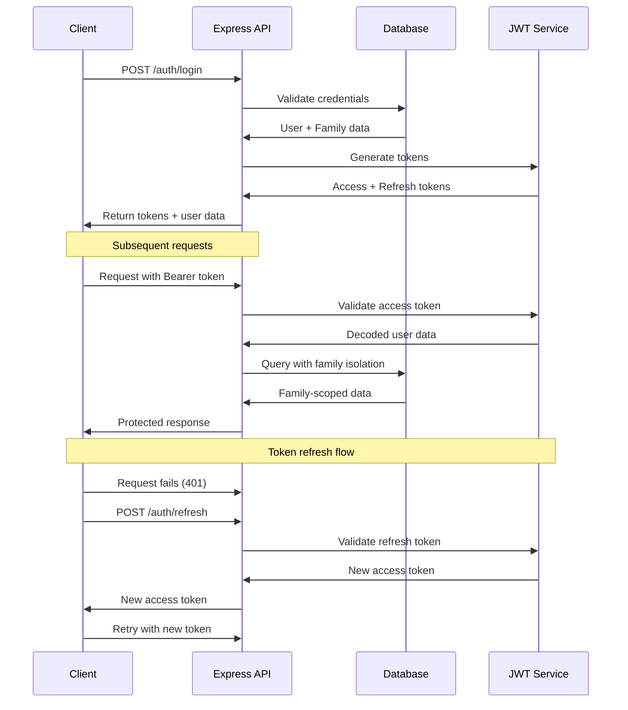

# Backend Architecture

## Service Architecture

### Controller/Route Organization

```
src/
├── routes/              # API route definitions
│   ├── auth.ts          # Authentication endpoints
│   ├── families.ts      # Family management endpoints
│   ├── tasks.ts         # Task CRUD endpoints
│   ├── events.ts        # Event CRUD endpoints
│   └── sync.ts          # Offline sync endpoints
├── controllers/         # Route handlers
│   ├── AuthController.ts
│   ├── FamilyController.ts
│   ├── TaskController.ts
│   ├── EventController.ts
│   └── SyncController.ts
├── services/            # Business logic
│   ├── AuthService.ts
│   ├── FamilyService.ts
│   ├── TaskService.ts
│   ├── EventService.ts
│   └── SyncService.ts
├── repositories/        # Data access layer
│   ├── BaseRepository.ts
│   ├── FamilyRepository.ts
│   ├── TaskRepository.ts
│   └── EventRepository.ts
├── middleware/          # Express middleware
│   ├── auth.ts          # JWT authentication
│   ├── family-access.ts # Family data isolation
│   ├── validation.ts    # Request validation
│   └── error-handler.ts # Error handling
└── utils/              # Backend utilities
    ├── jwt.ts
    ├── encryption.ts
    └── sync-helpers.ts
```

### Controller Template

```typescript
import { Request, Response, NextFunction } from 'express';
import { TaskService } from '@/services/TaskService';
import { CreateTaskSchema, UpdateTaskSchema } from '@/schemas/task';
import { ApiError } from '@/utils/errors';
import { z } from 'zod';

interface AuthenticatedRequest extends Request {
  user: {
    id: string;
    familyId: string;
    role: 'admin' | 'member';
  };
}

export class TaskController {
  constructor(private taskService: TaskService) {}
  
  getTasks = async (req: AuthenticatedRequest, res: Response, next: NextFunction) => {
    try {
      const { week, assigneeId } = req.query;
      const { familyId } = req.user;
      
      const weekStart = week ? new Date(week as string) : new Date();
      
      const tasks = await this.taskService.getTasksForFamily(
        familyId,
        weekStart,
        assigneeId as string
      );
      
      res.json(tasks);
    } catch (error) {
      next(error);
    }
  };
  
  createTask = async (req: AuthenticatedRequest, res: Response, next: NextFunction) => {
    try {
      const taskData = CreateTaskSchema.parse(req.body);
      const { user } = req;
      
      // Validate assignee is in same family
      const isValidAssignee = await this.taskService.validateFamilyMember(
        user.familyId,
        taskData.assigneeId
      );
      
      if (!isValidAssignee) {
        throw new ApiError(400, 'Invalid assignee - must be family member');
      }
      
      const task = await this.taskService.createTask({
        ...taskData,
        familyId: user.familyId,
        createdById: user.id,
      });
      
      res.status(201).json(task);
    } catch (error) {
      if (error instanceof z.ZodError) {
        return next(new ApiError(400, 'Validation error', error.errors));
      }
      next(error);
    }
  };
  
  updateTask = async (req: AuthenticatedRequest, res: Response, next: NextFunction) => {
    try {
      const { taskId } = req.params;
      const updateData = UpdateTaskSchema.parse(req.body);
      const { user } = req;
      
      // Check task exists and belongs to family
      const existingTask = await this.taskService.getTaskById(taskId);
      if (!existingTask || existingTask.familyId !== user.familyId) {
        throw new ApiError(404, 'Task not found');
      }
      
      // Handle sync conflicts
      if (updateData.syncVersion && updateData.syncVersion !== existingTask.syncVersion) {
        return res.status(409).json({
          error: 'Sync conflict detected',
          latestVersion: existingTask
        });
      }
      
      const updatedTask = await this.taskService.updateTask(taskId, {
        ...updateData,
        syncVersion: existingTask.syncVersion + 1
      });
      
      res.json(updatedTask);
    } catch (error) {
      next(error);
    }
  };
  
  deleteTask = async (req: AuthenticatedRequest, res: Response, next: NextFunction) => {
    try {
      const { taskId } = req.params;
      const { user } = req;
      
      const task = await this.taskService.getTaskById(taskId);
      if (!task || task.familyId !== user.familyId) {
        throw new ApiError(404, 'Task not found');
      }
      
      await this.taskService.deleteTask(taskId);
      res.status(204).send();
    } catch (error) {
      next(error);
    }
  };
}
```

## Database Architecture

### Schema Design

```sql
-- Production schema with optimizations for family coordination queries

-- Enable foreign key constraints (SQLite)
PRAGMA foreign_keys = ON;

-- Families with invite-based access control
CREATE TABLE families (
    id TEXT PRIMARY KEY DEFAULT (lower(hex(randomblob(16)))),
    name TEXT NOT NULL,
    invite_code TEXT UNIQUE NOT NULL DEFAULT (lower(hex(randomblob(8)))),
    settings JSON NOT NULL DEFAULT '{"weekStartDay":"sunday","timezone":"UTC","notifications":{"taskDue":true,"taskAssigned":true,"taskCompleted":true}}',
    created_at DATETIME NOT NULL DEFAULT CURRENT_TIMESTAMP,
    updated_at DATETIME NOT NULL DEFAULT CURRENT_TIMESTAMP
);

-- Family members with role-based permissions
CREATE TABLE family_members (
    id TEXT PRIMARY KEY DEFAULT (lower(hex(randomblob(16)))),
    family_id TEXT NOT NULL,
    email TEXT UNIQUE NOT NULL,
    password_hash TEXT NOT NULL,
    name TEXT NOT NULL,
    role TEXT NOT NULL DEFAULT 'member' CHECK (role IN ('admin', 'member')),
    avatar_color TEXT NOT NULL DEFAULT '#3B82F6',
    is_active BOOLEAN NOT NULL DEFAULT 1,
    created_at DATETIME NOT NULL DEFAULT CURRENT_TIMESTAMP,
    updated_at DATETIME NOT NULL DEFAULT CURRENT_TIMESTAMP,
    last_seen_at DATETIME NOT NULL DEFAULT CURRENT_TIMESTAMP,
    
    FOREIGN KEY (family_id) REFERENCES families (id) ON DELETE CASCADE
);

-- Tasks optimized for weekly dashboard queries
CREATE TABLE tasks (
    id TEXT PRIMARY KEY DEFAULT (lower(hex(randomblob(16)))),
    family_id TEXT NOT NULL,
    title TEXT NOT NULL,
    description TEXT,
    assignee_id TEXT NOT NULL,
    created_by_id TEXT NOT NULL,
    due_date DATETIME,
    completed_at DATETIME,
    status TEXT NOT NULL DEFAULT 'pending' CHECK (status IN ('pending', 'in_progress', 'completed')),
    category TEXT NOT NULL DEFAULT 'task' CHECK (category IN ('task', 'event')),
    priority TEXT NOT NULL DEFAULT 'medium' CHECK (priority IN ('low', 'medium', 'high')),
    sync_version INTEGER NOT NULL DEFAULT 1,
    created_at DATETIME NOT NULL DEFAULT CURRENT_TIMESTAMP,
    updated_at DATETIME NOT NULL DEFAULT CURRENT_TIMESTAMP,
    
    FOREIGN KEY (family_id) REFERENCES families (id) ON DELETE CASCADE,
    FOREIGN KEY (assignee_id) REFERENCES family_members (id) ON DELETE CASCADE,
    FOREIGN KEY (created_by_id) REFERENCES family_members (id) ON DELETE CASCADE
);

-- Performance indexes for mobile app queries
CREATE INDEX idx_tasks_family_week ON tasks(family_id, due_date) WHERE due_date IS NOT NULL;
CREATE INDEX idx_tasks_assignee_status ON tasks(assignee_id, status);
CREATE INDEX idx_tasks_family_status ON tasks(family_id, status);
CREATE INDEX idx_tasks_sync ON tasks(family_id, updated_at);

-- Triggers for automatic updated_at management
CREATE TRIGGER update_families_timestamp 
    AFTER UPDATE ON families
    BEGIN
        UPDATE families SET updated_at = CURRENT_TIMESTAMP WHERE id = NEW.id;
    END;

CREATE TRIGGER update_family_members_timestamp 
    AFTER UPDATE ON family_members
    BEGIN
        UPDATE family_members SET updated_at = CURRENT_TIMESTAMP WHERE id = NEW.id;
    END;

CREATE TRIGGER update_tasks_timestamp 
    AFTER UPDATE ON tasks
    BEGIN
        UPDATE tasks SET updated_at = CURRENT_TIMESTAMP WHERE id = NEW.id;
    END;
```

### Data Access Layer

```typescript
import { Database } from 'sqlite3';
import { Task, CreateTaskInput, UpdateTaskInput } from '@shared/types';

export interface DatabaseConnection {
  get<T = any>(sql: string, params?: any[]): Promise<T | undefined>;
  all<T = any>(sql: string, params?: any[]): Promise<T[]>;
  run(sql: string, params?: any[]): Promise<{ lastID?: number; changes: number }>;
}

export class BaseRepository {
  constructor(protected db: DatabaseConnection) {}
  
  protected async findById<T>(table: string, id: string): Promise<T | null> {
    const result = await this.db.get<T>(`SELECT * FROM ${table} WHERE id = ?`, [id]);
    return result || null;
  }
  
  protected async findByCondition<T>(
    table: string, 
    condition: string, 
    params: any[]
  ): Promise<T[]> {
    return this.db.all<T>(`SELECT * FROM ${table} WHERE ${condition}`, params);
  }
}

export class TaskRepository extends BaseRepository {
  async findByFamilyAndWeek(
    familyId: string, 
    weekStart: Date, 
    weekEnd: Date,
    assigneeId?: string
  ): Promise<Task[]> {
    let sql = `
      SELECT t.*, 
             fm_assignee.name as assignee_name,
             fm_assignee.avatar_color as assignee_color,
             fm_creator.name as creator_name
      FROM tasks t
      JOIN family_members fm_assignee ON t.assignee_id = fm_assignee.id
      JOIN family_members fm_creator ON t.created_by_id = fm_creator.id
      WHERE t.family_id = ?
        AND (t.due_date IS NULL OR (t.due_date >= ? AND t.due_date <= ?))
    `;
    
    const params = [familyId, weekStart.toISOString(), weekEnd.toISOString()];
    
    if (assigneeId) {
      sql += ' AND t.assignee_id = ?';
      params.push(assigneeId);
    }
    
    sql += ' ORDER BY t.due_date ASC, t.created_at ASC';
    
    return this.db.all<Task>(sql, params);
  }
  
  async create(input: CreateTaskInput & { familyId: string; createdById: string }): Promise<Task> {
    const id = generateId();
    const now = new Date().toISOString();
    
    await this.db.run(`
      INSERT INTO tasks (
        id, family_id, title, description, assignee_id, created_by_id,
        due_date, status, category, priority, created_at, updated_at
      ) VALUES (?, ?, ?, ?, ?, ?, ?, ?, ?, ?, ?, ?)
    `, [
      id, input.familyId, input.title, input.description, input.assigneeId,
      input.createdById, input.dueDate?.toISOString(), input.status || 'pending',
      input.category || 'task', input.priority || 'medium', now, now
    ]);
    
    const task = await this.findById<Task>('tasks', id);
    if (!task) {
      throw new Error('Failed to create task');
    }
    
    return task;
  }
  
  async update(id: string, updates: Partial<UpdateTaskInput>): Promise<Task> {
    const setParts: string[] = [];
    const params: any[] = [];
    
    Object.entries(updates).forEach(([key, value]) => {
      if (value !== undefined) {
        setParts.push(`${key} = ?`);
        params.push(value);
      }
    });
    
    if (setParts.length === 0) {
      throw new Error('No updates provided');
    }
    
    setParts.push('updated_at = ?');
    params.push(new Date().toISOString());
    params.push(id);
    
    await this.db.run(
      `UPDATE tasks SET ${setParts.join(', ')} WHERE id = ?`,
      params
    );
    
    const task = await this.findById<Task>('tasks', id);
    if (!task) {
      throw new Error('Task not found after update');
    }
    
    return task;
  }
  
  async findConflicts(familyId: string, since: Date): Promise<Task[]> {
    return this.db.all<Task>(`
      SELECT * FROM tasks 
      WHERE family_id = ? AND updated_at > ?
      ORDER BY updated_at ASC
    `, [familyId, since.toISOString()]);
  }
}

function generateId(): string {
  return require('crypto').randomBytes(16).toString('hex');
}
```

## Authentication and Authorization

### Auth Flow



### Middleware/Guards

```typescript
import { Request, Response, NextFunction } from 'express';
import jwt from 'jsonwebtoken';
import { ApiError } from '@/utils/errors';
import { FamilyRepository } from '@/repositories/FamilyRepository';

interface JwtPayload {
  userId: string;
  familyId: string;
  role: 'admin' | 'member';
  iat: number;
  exp: number;
}

interface AuthenticatedRequest extends Request {
  user: {
    id: string;
    familyId: string;
    role: 'admin' | 'member';
  };
}

export const authenticateToken = async (
  req: AuthenticatedRequest, 
  res: Response, 
  next: NextFunction
) => {
  try {
    const authHeader = req.headers.authorization;
    const token = authHeader?.startsWith('Bearer ') ? authHeader.slice(7) : null;
    
    if (!token) {
      throw new ApiError(401, 'Access token required');
    }
    
    const decoded = jwt.verify(token, process.env.JWT_SECRET!) as JwtPayload;
    
    // Verify family membership is still active
    const familyRepo = new FamilyRepository(req.app.locals.db);
    const isMember = await familyRepo.isFamilyMember(decoded.familyId, decoded.userId);
    
    if (!isMember) {
      throw new ApiError(401, 'Family membership revoked');
    }
    
    req.user = {
      id: decoded.userId,
      familyId: decoded.familyId,
      role: decoded.role,
    };
    
    next();
  } catch (error) {
    if (error instanceof jwt.JsonWebTokenError) {
      return next(new ApiError(401, 'Invalid access token'));
    }
    next(error);
  }
};

export const requireFamilyAdmin = (
  req: AuthenticatedRequest, 
  res: Response, 
  next: NextFunction
) => {
  if (req.user.role !== 'admin') {
    return next(new ApiError(403, 'Family admin privileges required'));
  }
  next();
};

export const enforceFamilyDataIsolation = (
  req: AuthenticatedRequest, 
  res: Response, 
  next: NextFunction
) => {
  // Add family ID filter to all database queries
  req.query.familyId = req.user.familyId;
  next();
};

// Rate limiting middleware for API protection
import rateLimit from 'express-rate-limit';

export const createRateLimiter = (windowMs: number, max: number) => 
  rateLimit({
    windowMs,
    max,
    message: { error: 'Too many requests, please try again later' },
    standardHeaders: true,
    legacyHeaders: false,
  });

// Apply different limits per endpoint type
export const authLimiter = createRateLimiter(15 * 60 * 1000, 5); // 5 attempts per 15 minutes
export const apiLimiter = createRateLimiter(60 * 1000, 100); // 100 requests per minute
export const syncLimiter = createRateLimiter(60 * 1000, 20); // 20 sync operations per minute
```
