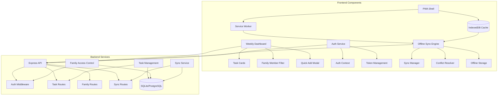

# Components

## Frontend PWA Shell

**Responsibility:** Service worker management, offline detection, app shell caching, and PWA installation prompts

**Key Interfaces:**
- Service worker registration and lifecycle management
- IndexedDB cache coordination with backend sync
- Network status detection and offline UI state management
- PWA install prompt handling

**Dependencies:** Browser APIs (Service Worker, IndexedDB, Notification), React context providers

**Technology Stack:** Service Worker API, Workbox for caching strategies, React context for offline state

## Weekly Dashboard Component

**Responsibility:** Primary UI component implementing the weekly calendar view with family task visualization and quick interaction patterns

**Key Interfaces:**
- WeekNavigationProps for week switching
- TaskCardProps for individual task rendering
- FamilyMemberFilter for workload distribution view
- QuickAddModal trigger integration

**Dependencies:** React Query for server state, Zustand for local UI state, Task and Event data models

**Technology Stack:** React 18 functional components, Tailwind CSS grid system, React Query mutations for optimistic updates

## Task Management Service

**Responsibility:** Backend business logic for task CRUD operations, family data isolation enforcement, and sync conflict resolution

**Key Interfaces:**
- REST API endpoints (/tasks, /tasks/:id)
- Database repository interface for SQLite/PostgreSQL abstraction
- Family permission validation middleware
- Sync conflict detection and resolution logic

**Dependencies:** Express.js routing, database connection, JWT authentication middleware, family access control

**Technology Stack:** Node.js/Express controllers, repository pattern for data access, bcrypt for security

## Offline Sync Engine

**Responsibility:** Client-side coordination of online/offline state, optimistic UI updates, change queue management, and conflict resolution

**Key Interfaces:**
- SyncManager for orchestrating sync operations
- ConflictResolver for handling server/client data mismatches
- OfflineStorage interface for IndexedDB operations
- NetworkStatusProvider for connectivity monitoring

**Dependencies:** IndexedDB storage, React Query cache invalidation, Service Worker background sync

**Technology Stack:** IndexedDB API, React Query for server state management, custom sync logic with exponential backoff

## Authentication & Authorization Service

**Responsibility:** JWT token management, family-based access control, user session handling, and secure family invitation system

**Key Interfaces:**
- AuthProvider React context for token management
- Family access control middleware for API routes
- Invitation code generation and validation
- Password security and session management

**Dependencies:** JWT library, bcrypt for password hashing, Express.js middleware, family data model

**Technology Stack:** jsonwebtoken, bcrypt, Express.js middleware pattern, React context API

## Component Diagrams

