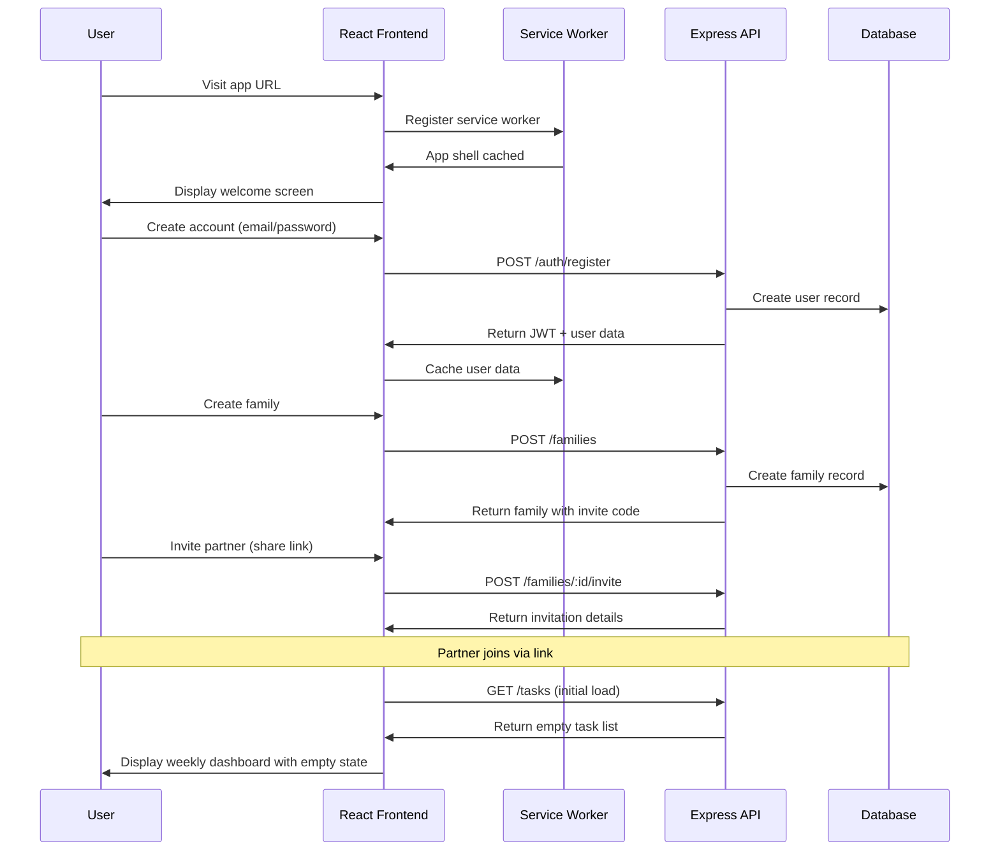
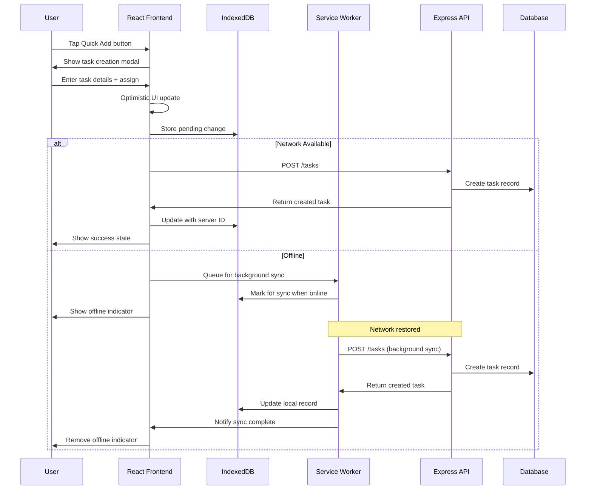
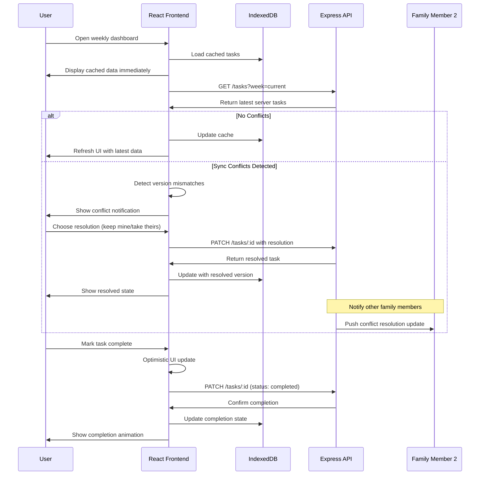

# Core Workflows

## Family Onboarding and Setup Flow

```mermaid
sequenceDiagram
    participant U as User
    participant FE as React Frontend
    participant SW as Service Worker
    participant API as Express API
    participant DB as Database
    
    U->>FE: Visit app URL
    FE->>SW: Register service worker
    SW->>FE: App shell cached
    FE->>U: Display welcome screen
    
    U->>FE: Create account (email/password)
    FE->>API: POST /auth/register
    API->>DB: Create user record
    API->>FE: Return JWT + user data
    FE->>SW: Cache user data
    
    U->>FE: Create family
    FE->>API: POST /families
    API->>DB: Create family record
    API->>FE: Return family with invite code
    
    U->>FE: Invite partner (share link)
    FE->>API: POST /families/:id/invite
    API->>FE: Return invitation details
    
    Note over U,DB: Partner joins via link
    
    FE->>API: GET /tasks (initial load)
    API->>FE: Return empty task list
    FE->>U: Display weekly dashboard with empty state
```

## Quick Task Creation with Offline Support

```mermaid
sequenceDiagram
    participant U as User
    participant FE as React Frontend
    participant IDB as IndexedDB
    participant SW as Service Worker
    participant API as Express API
    participant DB as Database
    
    U->>FE: Tap Quick Add button
    FE->>U: Show task creation modal
    
    U->>FE: Enter task details + assign
    FE->>FE: Optimistic UI update
    FE->>IDB: Store pending change
    
    alt Network Available
        FE->>API: POST /tasks
        API->>DB: Create task record
        API->>FE: Return created task
        FE->>IDB: Update with server ID
        FE->>U: Show success state
    else Offline
        FE->>SW: Queue for background sync
        SW->>IDB: Mark for sync when online
        FE->>U: Show offline indicator
        
        Note over SW,API: Network restored
        SW->>API: POST /tasks (background sync)
        API->>DB: Create task record
        API->>SW: Return created task
        SW->>IDB: Update local record
        SW->>FE: Notify sync complete
        FE->>U: Remove offline indicator
    end
```

## Weekly Coordination Check with Conflict Resolution

```mermaid
sequenceDiagram
    participant U as User
    participant FE as React Frontend
    participant IDB as IndexedDB
    participant API as Express API
    participant U2 as Family Member 2
    
    U->>FE: Open weekly dashboard
    FE->>IDB: Load cached tasks
    FE->>U: Display cached data immediately
    
    FE->>API: GET /tasks?week=current
    API->>FE: Return latest server tasks
    
    alt No Conflicts
        FE->>IDB: Update cache
        FE->>U: Refresh UI with latest data
    else Sync Conflicts Detected
        FE->>FE: Detect version mismatches
        FE->>U: Show conflict notification
        
        U->>FE: Choose resolution (keep mine/take theirs)
        FE->>API: PATCH /tasks/:id with resolution
        API->>FE: Return resolved task
        FE->>IDB: Update with resolved version
        FE->>U: Show resolved state
        
        Note over API,U2: Notify other family members
        API->>U2: Push conflict resolution update
    end
    
    U->>FE: Mark task complete
    FE->>FE: Optimistic UI update
    FE->>API: PATCH /tasks/:id (status: completed)
    API->>FE: Confirm completion
    FE->>IDB: Update completion state
    FE->>U: Show completion animation
```
