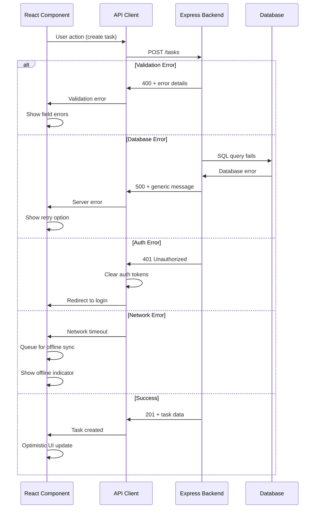

# Error Handling Strategy

## Error Flow



## Error Response Format

```typescript
interface ApiError {
  error: {
    code: string;
    message: string;
    details?: Record<string, any>;
    timestamp: string;
    requestId: string;
  };
}

// Example error responses
const validationError: ApiError = {
  error: {
    code: 'VALIDATION_ERROR',
    message: 'Invalid input data',
    details: {
      title: 'Title is required',
      assigneeId: 'Assignee must be a family member'
    },
    timestamp: '2025-09-01T12:00:00.000Z',
    requestId: 'req_123abc'
  }
};

const authError: ApiError = {
  error: {
    code: 'UNAUTHORIZED',
    message: 'Authentication required',
    timestamp: '2025-09-01T12:00:00.000Z',
    requestId: 'req_456def'
  }
};

const syncConflictError: ApiError = {
  error: {
    code: 'SYNC_CONFLICT',
    message: 'Task was modified by another family member',
    details: {
      latestVersion: { /* current task data */ },
      conflictingFields: ['title', 'status']
    },
    timestamp: '2025-09-01T12:00:00.000Z',
    requestId: 'req_789ghi'
  }
};
```

## Frontend Error Handling

```typescript
// Global error boundary for React components
import { ErrorBoundary } from 'react-error-boundary';

const ErrorFallback: React.FC<{ error: Error; resetErrorBoundary: () => void }> = ({
  error,
  resetErrorBoundary
}) => (
  <div className="min-h-screen flex items-center justify-center bg-gray-50">
    <div className="max-w-md w-full bg-white rounded-lg shadow-md p-6">
      <div className="text-red-600 text-center mb-4">
        <ExclamationTriangleIcon className="w-12 h-12 mx-auto mb-2" />
        <h2 className="text-lg font-semibold">Something went wrong</h2>
      </div>
      
      <p className="text-gray-600 text-center mb-4">
        We encountered an unexpected error. Please try refreshing the page.
      </p>
      
      {process.env.NODE_ENV === 'development' && (
        <details className="mt-4 p-3 bg-gray-100 rounded text-sm">
          <summary className="font-medium cursor-pointer">Error Details</summary>
          <pre className="mt-2 text-xs overflow-auto">{error.message}</pre>
        </details>
      )}
      
      <div className="flex gap-3 mt-6">
        <button
          onClick={resetErrorBoundary}
          className="flex-1 bg-blue-600 text-white py-2 px-4 rounded hover:bg-blue-700"
        >
          Try Again
        </button>
        <button
          onClick={() => window.location.reload()}
          className="flex-1 bg-gray-600 text-white py-2 px-4 rounded hover:bg-gray-700"
        >
          Refresh Page
        </button>
      </div>
    </div>
  </div>
);

// API client error handling
class ApiClient {
  private handleError(error: AxiosError): never {
    const response = error.response;
    
    if (!response) {
      // Network error - queue for offline sync
      throw new NetworkError('Unable to connect to server');
    }
    
    switch (response.status) {
      case 400:
        throw new ValidationError(response.data.error.message, response.data.error.details);
      case 401:
        // Clear auth and redirect
        useAuthStore.getState().clearAuth();
        window.location.href = '/auth/login';
        throw new AuthError('Authentication required');
      case 403:
        throw new AuthError('Insufficient permissions');
      case 409:
        throw new SyncConflictError('Data conflict', response.data.error.details);
      case 429:
        throw new RateLimitError('Too many requests');
      default:
        throw new ServerError('Server error occurred');
    }
  }
}

// Custom error classes
export class NetworkError extends Error {
  constructor(message: string) {
    super(message);
    this.name = 'NetworkError';
  }
}

export class ValidationError extends Error {
  constructor(message: string, public details?: Record<string, string>) {
    super(message);
    this.name = 'ValidationError';
  }
}

export class SyncConflictError extends Error {
  constructor(message: string, public conflictData?: any) {
    super(message);
    this.name = 'SyncConflictError';
  }
}
```

## Backend Error Handling

```typescript
// Global error handling middleware
import { Request, Response, NextFunction } from 'express';
import { v4 as uuidv4 } from 'uuid';

export class ApiError extends Error {
  constructor(
    public statusCode: number,
    public message: string,
    public details?: any,
    public code?: string
  ) {
    super(message);
    this.name = 'ApiError';
  }
}

export const errorHandler = (
  err: Error,
  req: Request,
  res: Response,
  next: NextFunction
) => {
  const requestId = req.headers['x-request-id'] || uuidv4();
  const timestamp = new Date().toISOString();
  
  // Log error for debugging
  console.error(`[${timestamp}] [${requestId}] Error:`, {
    message: err.message,
    stack: err.stack,
    url: req.url,
    method: req.method,
    body: req.body,
    user: req.user?.id
  });
  
  if (err instanceof ApiError) {
    return res.status(err.statusCode).json({
      error: {
        code: err.code || 'API_ERROR',
        message: err.message,
        details: err.details,
        timestamp,
        requestId
      }
    });
  }
  
  // Database errors
  if (err.message.includes('SQLITE_CONSTRAINT')) {
    return res.status(409).json({
      error: {
        code: 'CONSTRAINT_VIOLATION',
        message: 'Data constraint violation',
        timestamp,
        requestId
      }
    });
  }
  
  // JWT errors
  if (err.name === 'JsonWebTokenError') {
    return res.status(401).json({
      error: {
        code: 'INVALID_TOKEN',
        message: 'Invalid authentication token',
        timestamp,
        requestId
      }
    });
  }
  
  // Default server error
  res.status(500).json({
    error: {
      code: 'INTERNAL_SERVER_ERROR',
      message: 'An unexpected error occurred',
      timestamp,
      requestId
    }
  });
};

// Async error wrapper for controllers
export const asyncHandler = (fn: Function) => (req: Request, res: Response, next: NextFunction) => {
  Promise.resolve(fn(req, res, next)).catch(next);
};

// Usage in controllers
export class TaskController {
  createTask = asyncHandler(async (req: Request, res: Response) => {
    const taskData = CreateTaskSchema.parse(req.body);
    
    if (!taskData.assigneeId) {
      throw new ApiError(400, 'Assignee is required', { field: 'assigneeId' }, 'MISSING_ASSIGNEE');
    }
    
    const task = await this.taskService.createTask(taskData);
    res.status(201).json(task);
  });
}
```
