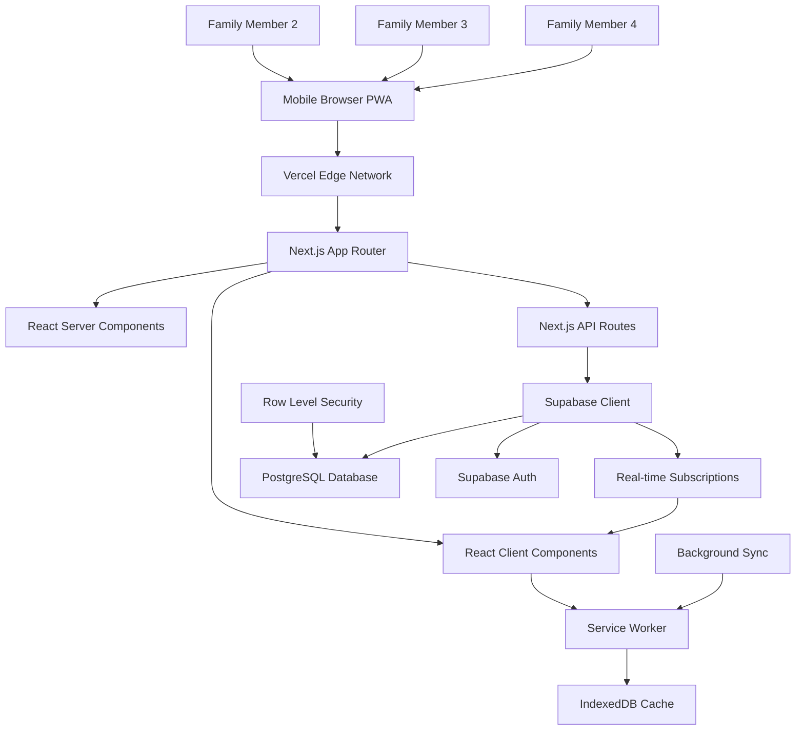

# High Level Architecture

## Technical Summary

FamilySync is built as a mobile-first Progressive Web App (PWA) using Next.js 14+ with the App Router for optimal full-stack integration. The architecture leverages React Server Components for fast initial loads, Next.js API Routes for serverless backend functions, and Supabase for managed PostgreSQL database with real-time capabilities. The frontend implements React 18 with TypeScript, supporting the weekly dashboard, quick-add workflows, and family coordination features defined in the UI/UX specification. Supabase provides built-in authentication, Row Level Security for family data isolation, and real-time subscriptions for live coordination updates. The architecture emphasizes service worker implementation for offline functionality, IndexedDB for local persistence, and optimistic UI updates to maintain the "Glance-and-Go" performance targets while supporting seamless family member collaboration across devices.

## Platform and Infrastructure Choice

**Platform:** Vercel + Supabase Full-Stack Architecture  
**Key Services:** Vercel (Next.js Full-Stack), Supabase (PostgreSQL + Auth + Real-time), IndexedDB (Offline Storage), Service Worker (PWA)  
**Deployment Host and Regions:** Global CDN via Vercel Edge Network, Supabase global multi-region PostgreSQL  

**Rationale:** Vercel provides optimal Next.js deployment with zero-config PWA support and global edge caching. Supabase eliminates backend complexity with managed PostgreSQL, built-in authentication, Row Level Security, and real-time subscriptions - perfect for solo developer productivity while supporting 10,000+ families from day one without migration complexity.

## Repository Structure

**Structure:** Next.js monolithic full-stack application  
**Monorepo Tool:** Not required - single Next.js project with organized folder structure  
**Package Organization:** Next.js app with organized src/ structure for components, API routes, and utilities - simplified for solo developer efficiency

## High Level Architecture Diagram

## Architectural Patterns

- **Next.js App Router:** File-based routing with React Server Components for optimal performance - _Rationale:_ Enables fast initial loads, simplified architecture, and excellent developer experience for solo development
- **Progressive Web App (PWA):** Offline-first architecture with service workers and app shell caching - _Rationale:_ Enables 7-day offline capability and native app-like experience on mobile devices
- **Component-Based UI:** Reusable React components with TypeScript interfaces - _Rationale:_ Supports the detailed component library from front-end spec and enables consistent UX patterns
- **Supabase Real-time:** WebSocket-based real-time subscriptions - _Rationale:_ Enables live family coordination updates without polling, reducing server load and improving UX
- **Row Level Security (RLS):** Database-level family data isolation - _Rationale:_ Eliminates backend filtering complexity and prevents cross-family data access at the database layer
- **Optimistic UI Updates:** Immediate UI feedback before server confirmation - _Rationale:_ Critical for "Glance-and-Go" performance targets and mobile responsiveness
- **Offline-First Sync:** Local-first architecture with eventual consistency - _Rationale:_ Core differentiator supporting reliable family coordination during network outages
