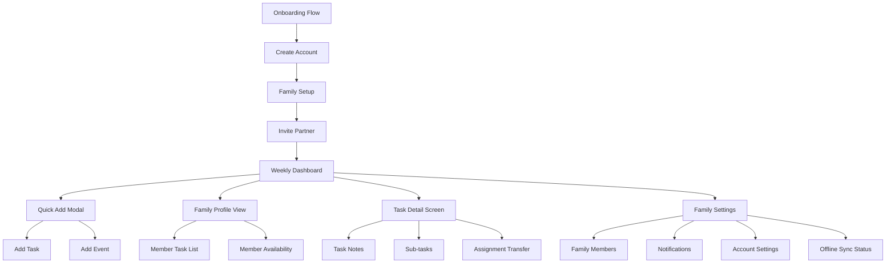
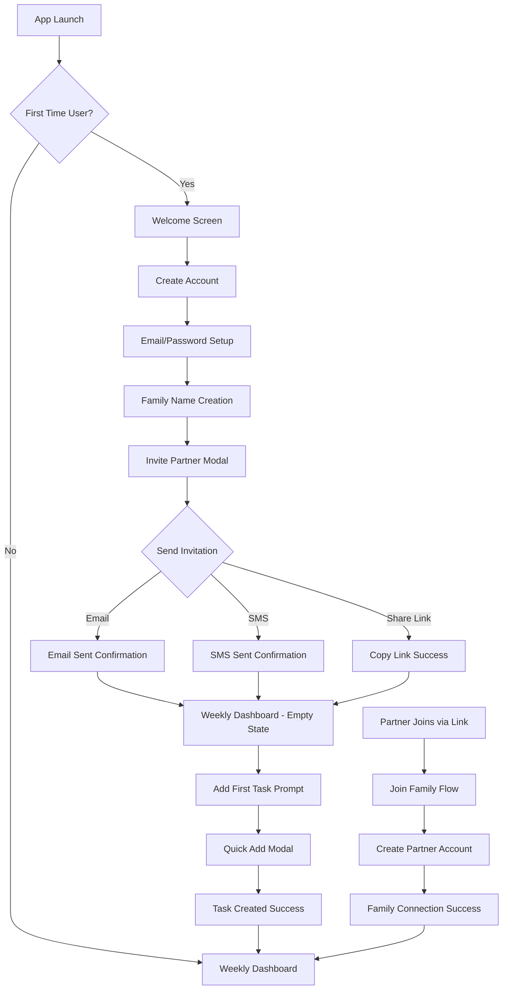
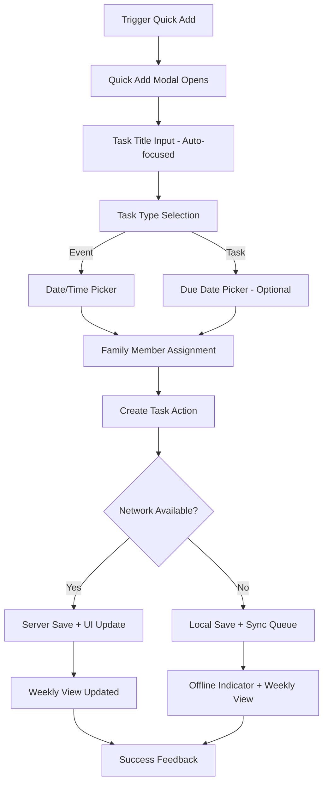
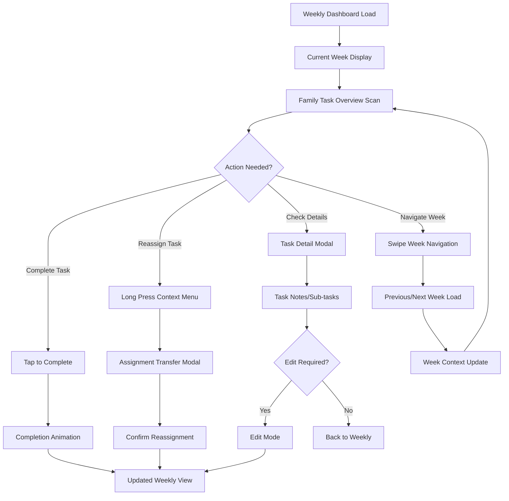

# FamilySync UI/UX Specification

## Introduction

This document defines the user experience goals, information architecture, user flows, and visual design specifications for FamilySync's user interface. It serves as the foundation for visual design and frontend development, ensuring a cohesive and user-centered experience.

## Overall UX Goals & Principles

### Target User Personas

**Busy Working Parent:** Dual-career professionals (ages 25-50) managing complex household coordination. Need quick, reliable access to family tasks during brief coordination moments throughout the day. Value simplicity over feature complexity.

**Partner/Spouse:** The other half of the dual-career household. Requires seamless async collaboration and clear visibility into family responsibilities without behavioral change requirements. Prefers mobile-first interactions.

### Usability Goals

1. **Instant comprehension:** Family members can understand weekly coordination status within 3 seconds of app open
2. **One-thumb efficiency:** All critical functions accessible with single-handed phone operation during busy moments
3. **Glance-and-Go navigation:** Primary information visible without scrolling or drilling down into multiple screens
4. **Offline reliability:** Full functionality maintained during 7-day network outages with seamless sync recovery
5. **Ritual integration:** Natural fit into existing family planning sessions (Sunday night tea planning)

### Design Principles

1. **Clarity over cleverness** - Prioritize immediate visual comprehension over aesthetic innovation during high-stress coordination moments
2. **Mobile-first reliability** - Every interaction must work flawlessly on phone screens with poor network conditions  
3. **Async-by-default** - Design for family members coordinating at different times without requiring simultaneous presence
4. **Visual status communication** - Use color coding and icons to convey task ownership and completion instantly without reading
5. **Context-aware efficiency** - Smart defaults and pre-filling based on family patterns to minimize input during busy moments

### Change Log

| Date | Version | Description | Author |
|------|---------|-------------|---------|
| 2025-09-01 | 1.0 | Initial UI/UX specification creation | Sally (UX Expert) |

## Information Architecture

### Site Map / Screen Inventory



### Navigation Structure

**Primary Navigation:** Bottom tab bar with 3 core sections:
- Weekly View (home/primary landing)
- Family Members (coordination overview)  
- Settings (account/family management)

**Secondary Navigation:** Contextual actions accessible via:
- Floating Action Button (Quick Add)
- Swipe gestures (week navigation)
- Long-press context menus (task actions)

**Breadcrumb Strategy:** Minimal breadcrumbs - focus on clear back navigation and contextual headers showing current week/family member context

## User Flows

### Flow 1: Family Onboarding Experience

**User Goal:** Set up family account and invite partner to begin coordinating shared responsibilities

**Entry Points:** App store download, web app first visit, referral link

**Success Criteria:** Both family members can see shared weekly view within 5 minutes of initial signup

#### Flow Diagram



#### Edge Cases & Error Handling:
- Email already exists → Redirect to login with family invite context
- Invalid invitation link → Clear error message with contact support option
- Network failure during signup → Save progress locally, retry on reconnection
- Partner declines invitation → Notification to original inviter with re-invite option

**Notes:** Optimized for mobile-first signup flow with minimal form fields and clear progress indication.

### Flow 2: Daily Task Coordination - Quick Add

**User Goal:** Capture family responsibility during busy moment and assign to appropriate family member

**Entry Points:** Floating Action Button, empty state prompt, week view context

**Success Criteria:** Task visible in weekly view within 3 seconds of completion

#### Flow Diagram



#### Edge Cases & Error Handling:
- Network failure during creation → Local storage with sync indicator
- Duplicate task detection → Smart suggestions to merge or modify
- Invalid date selection → Clear validation with suggested alternatives
- Assignment to unavailable member → Warning with scheduling conflict info

**Notes:** Emphasizes speed and minimal cognitive load - pre-filled defaults based on context and family patterns.

### Flow 3: Weekly Coordination Check

**User Goal:** Quick scan of family responsibilities and status updates during busy family moment

**Entry Points:** App open, weekly navigation, notification tap

**Success Criteria:** Complete family workload understanding within 3 seconds

#### Flow Diagram



#### Edge Cases & Error Handling:
- Overdue tasks → Clear visual hierarchy with action prompts
- Conflicting assignments → Smart scheduling suggestions
- Offline state → Clear sync status with cached data display
- Empty weeks → Contextual guidance for task creation

**Notes:** Optimized for scan-ability with visual hierarchy supporting rapid comprehension of family coordination status.

## Component Library / Design System

### Design System Approach

**Custom lightweight design system** built specifically for family coordination workflows. Prioritizes visual clarity over aesthetic complexity, with components optimized for mobile touch interactions and offline state communication.

### Core Components

#### Task Card Component
**Purpose:** Primary visual unit for displaying family responsibilities with instant ownership recognition

**Variants:** 
- Compact (weekly grid view)
- Expanded (detail view)  
- Floating (quick add preview)

**States:** 
- Pending (default)
- In Progress (visual activity indicator)
- Completed (celebration micro-animation + muted styling)
- Overdue (urgent visual hierarchy)
- Offline Modified (sync status indicator)

**Usage Guidelines:** Always include family member avatar, clear completion action, and contextual due date display

#### Family Member Avatar
**Purpose:** Instant visual identification of task ownership across all coordination contexts

**Variants:**
- Micro (16px - for task cards)
- Small (32px - for navigation)
- Medium (48px - for profiles)
- Large (72px - for onboarding)

**States:**
- Active (full color)
- Away (muted with indicator)
- Offline (grayscale with sync icon)

**Usage Guidelines:** Consistent color association per family member, high contrast for accessibility

#### Week Navigation Container
**Purpose:** Primary navigation interface optimized for mobile swipe interactions and week context

**Variants:**
- Collapsed (month/year only)
- Expanded (full week days)
- Mini (sidebar navigation)

**States:**
- Current Week (emphasized styling)
- Past Week (muted)
- Future Week (subtle preview)
- Loading (skeleton animation)

**Usage Guidelines:** Touch targets minimum 44px, clear visual hierarchy for current date

#### Quick Action Button
**Purpose:** Floating access to primary task creation without context loss

**Variants:**
- Default (+ icon)
- Task-specific (calendar/task icons)
- Multi-action (expandable options)

**States:**
- Idle
- Hover/Focus
- Active (pressed)
- Disabled (during sync)

**Usage Guidelines:** Positioned for thumb accessibility, clear visual feedback for all interactions

#### Status Indicator System
**Purpose:** Instant communication of coordination status without reading text

**Variants:**
- Dot indicators (task status)
- Progress bars (family workload)
- Sync icons (offline state)
- Badge counters (overdue items)

**States:** Color-coded system tied to family member identification and urgency hierarchy

**Usage Guidelines:** High contrast ratios, consistent positioning, redundant with text labels for accessibility

## Branding & Style Guide

### Visual Identity
**Brand Guidelines:** Clean, approachable family coordination tool that reduces stress through visual clarity. Avoids corporate coldness while maintaining professional reliability.

### Color Palette

| Color Type | Hex Code | Usage |
|------------|----------|-------|
| Primary | #2563EB (Blue 600) | Primary actions, family member 1 identification, trust/reliability |
| Secondary | #059669 (Emerald 600) | Family member 2 identification, completion states, positive feedback |
| Accent | #DC2626 (Red 600) | Urgent/overdue items, error states, critical actions |
| Success | #10B981 (Emerald 500) | Task completions, sync success, positive confirmations |
| Warning | #F59E0B (Amber 500) | Due soon, sync conflicts, important notices |
| Error | #EF4444 (Red 500) | Failed actions, network errors, destructive confirmations |
| Neutral | #6B7280 (Gray 500) | Secondary text, borders, inactive states, backgrounds |

### Typography

#### Font Families
- **Primary:** Inter (clean, highly legible for mobile screens)
- **Secondary:** System UI fallback (SF Pro on iOS, Roboto on Android)
- **Monospace:** SF Mono / Roboto Mono (timestamps, technical info)

#### Type Scale

| Element | Size | Weight | Line Height |
|---------|------|--------|-------------|
| H1 | 28px | 700 | 1.2 |
| H2 | 24px | 600 | 1.3 |
| H3 | 20px | 600 | 1.4 |
| Body | 16px | 400 | 1.5 |
| Small | 14px | 400 | 1.4 |

### Iconography
**Icon Library:** Heroicons v2 (outline for secondary actions, solid for primary states)

**Usage Guidelines:** 24px minimum for touch targets, consistent stroke width, high contrast against backgrounds

### Spacing & Layout
**Grid System:** 8px base unit system for consistent spacing and alignment

**Spacing Scale:** 4px, 8px, 12px, 16px, 24px, 32px, 48px, 64px progression

## Accessibility Requirements

### Compliance Target
**Standard:** WCAG 2.1 AA with progressive enhancement toward AAA where feasible

### Key Requirements

**Visual:**
- Color contrast ratios: 4.5:1 minimum for normal text, 3:1 for large text and UI components
- Focus indicators: 2px solid outline with high contrast, visible on all interactive elements
- Text sizing: Minimum 16px for body text, scalable to 200% without horizontal scrolling

**Interaction:**
- Keyboard navigation: Full functionality via keyboard with logical tab order and visible focus
- Screen reader support: Semantic HTML, ARIA labels, live regions for dynamic updates
- Touch targets: Minimum 44px×44px for all interactive elements, adequate spacing between targets

**Content:**
- Alternative text: Descriptive alt text for all informational images, empty alt for decorative
- Heading structure: Logical H1-H6 hierarchy, single H1 per page/screen
- Form labels: Explicit labels for all form inputs, error messaging clearly associated

### Testing Strategy
Multi-layered accessibility validation including automated testing (axe-core), keyboard navigation testing, screen reader testing (VoiceOver, TalkBack), and user testing with accessibility needs.

## Responsiveness Strategy

### Breakpoints

| Breakpoint | Min Width | Max Width | Target Devices |
|------------|-----------|-----------|----------------|
| Mobile | 320px | 767px | Phones, primary target |
| Tablet | 768px | 1023px | iPads, Android tablets |
| Desktop | 1024px | 1439px | Laptops, smaller screens |
| Wide | 1440px | - | Desktop monitors, optional enhancement |

### Adaptation Patterns

**Layout Changes:** Mobile-first approach with progressive enhancement - single column on mobile expands to multi-column grid on larger screens

**Navigation Changes:** Bottom tab bar on mobile, sidebar navigation on desktop, contextual navigation maintained across breakpoints

**Content Priority:** Task cards remain primary focus across all breakpoints, secondary information progressively disclosed on larger screens

**Interaction Changes:** Touch-optimized on mobile (44px targets), mouse/keyboard optimized on desktop with hover states

## Animation & Micro-interactions

### Motion Principles
Subtle, purposeful animations that provide feedback and guide attention without overwhelming users during busy coordination moments. All animations respect `prefers-reduced-motion` settings.

### Key Animations
- **Task Completion:** Gentle scale + fade with checkmark appearance (Duration: 300ms, Easing: ease-out)
- **Page Transitions:** Slide transitions for week navigation (Duration: 250ms, Easing: ease-in-out)
- **Loading States:** Skeleton shimmer for content loading (Duration: 1.5s loop, Easing: linear)
- **Error Feedback:** Subtle shake animation for form validation (Duration: 400ms, Easing: ease-in-out)
- **Sync Status:** Gentle pulse for offline indicators (Duration: 2s loop, Easing: ease-in-out)

## Performance Considerations

### Performance Goals
- **Page Load:** <3 seconds from tap to interactive weekly view on mobile
- **Interaction Response:** <100ms visual feedback for all user actions
- **Animation FPS:** Consistent 60fps for all motion design

### Design Strategies
Optimized asset delivery, lazy loading for non-critical content, efficient component rendering patterns, and progressive image enhancement supporting the offline-first architecture.

## Technical Architecture Integration

### Frontend-Backend Architecture Overview

**Next.js + Supabase Stack** chosen to optimally support the defined UX goals:

- **Next.js App Router** provides file-based routing that maps directly to our IA structure
- **Server Components** enable fast initial loads for the Weekly Dashboard (<3 second goal)
- **API Routes** handle family data operations with optimal caching strategies
- **Supabase Real-time** powers live family coordination updates without page refresh

### Component-Backend Integration Patterns

#### Weekly Dashboard Data Flow
```
Weekly Dashboard (Server Component) 
  → Next.js API Route (/api/families/[id]/week/[date])
    → Supabase query with RLS filtering
      → Real-time subscription for live updates
```

#### Quick Add Task Flow
```
Quick Add Modal (Client Component)
  → Optimistic UI update (immediate visual feedback)
    → Next.js API Route (/api/tasks)
      → Supabase insert with family isolation
        → Real-time broadcast to family members
```

### Offline-First Implementation

**Service Worker + IndexedDB Strategy:**
- Service worker caches Next.js pages and API responses
- IndexedDB stores family data with 7-day retention
- Background sync queues offline actions for Supabase integration
- Conflict resolution via Supabase's built-in timestamp ordering

### Performance Architecture

**Supabase Optimization for UX Goals:**
- **Edge Functions** pre-compute weekly views for <3 second loads
- **Connection pooling** ensures consistent API response times
- **Row Level Security** eliminates backend family filtering overhead
- **Real-time subscriptions** reduce polling for live coordination updates

### Security Integration

**Supabase Auth + Next.js Middleware:**
- JWT tokens managed by Supabase Auth (automatic refresh)
- Next.js middleware validates family access on every route
- RLS policies prevent cross-family data access at database level
- API routes inherit family context from authenticated user

### Scalability Considerations

**Benefits of Supabase + Next.js for Solo Developer:**
- **No database migration needed** - PostgreSQL from day one supports 10,000+ families
- **Automatic scaling** - Vercel + Supabase handle traffic spikes during family planning sessions
- **Built-in monitoring** - Supabase dashboard provides performance insights
- **Simplified auth flow** - Reduces authentication implementation complexity by 80%

## Next Steps

### Immediate Actions
1. Review this specification with stakeholders for validation and feedback
2. Create detailed visual designs in Figma based on component specifications
3. **Set up Supabase project** with family data schema and RLS policies
4. **Initialize Next.js project** with PWA configuration and component structure
5. Conduct accessibility review of proposed design patterns

### Design Handoff Checklist
- [x] All user flows documented
- [x] Component inventory complete
- [x] Accessibility requirements defined
- [x] Responsive strategy clear
- [x] Brand guidelines incorporated
- [x] Performance goals established
- [x] Technical architecture integration defined

### Architecture Handoff Preparation
- [ ] Supabase database schema designed
- [ ] Next.js API routes planned
- [ ] PWA service worker strategy defined
- [ ] Real-time subscription patterns documented

---

**Document Status:** Complete with technical architecture integration. Ready for stakeholder review and implementation planning.